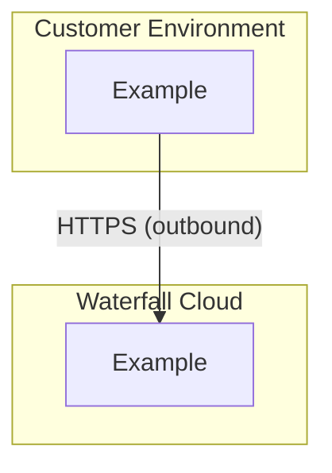

<div align="center">
  
</div>

# Waterfall Flask Template Architecture

This document records key architecture decisions for the Flask Template.

## Table of Contents

- [Deployment Model](#deployment-model)
- [Token Storage](#token-storage)
- [Identity Validation](#identity-validation)
- [Features Validation](#features-validation)
- [Security Considerations](#security-considerations)
- [References](#references)

---
## Deployment Model

### Decision

<!-- Add description -->

### Context

<!-- Add description -->

### Architecture



### Implications

<!-- Add description -->

---

## Other subject

### Decision

<!-- Add description -->

### Context

<!-- Add description -->

### Rationale

<!-- Add description -->

### Implementation

```python
# Sample description

```

### Implications

<!-- Add description -->

---

## Identity Validation

### Decision

The Flask Template **trusts the JWT** for `company_id` and `user_id`. No additional call to Identity service is made.

### Context

Options considered:

| Option | Pros | Cons |
|--------|------|------|
| **Call Identity API** | Real-time validation | Network dependency, latency, requires connectivity |
| **Trust JWT** | Fast, no network calls | Relies on JWT signature validity |

### Rationale

- JWT is already signed and validated by the License Server
- If JWT signature is valid, claims are trustworthy

### Implementation

```python
# JWT claims are extracted and trusted
company_id = jwt_claims["company_id"]  # Trusted
user_id = jwt_claims["user_id"]        # Trusted

# No call to: GET /identity/companies/{company_id}
```

### Implications

- Company/user existence is validated at JWT issuance time (by Identity)


---


## References

- [OWASP Password Storage Cheat Sheet](https://cheatsheetseries.owasp.org/cheatsheets/Password_Storage_Cheat_Sheet.html)
- [JWT Best Practices](https://datatracker.ietf.org/doc/html/rfc8725)
- [Other ref](<!-- link -->)
