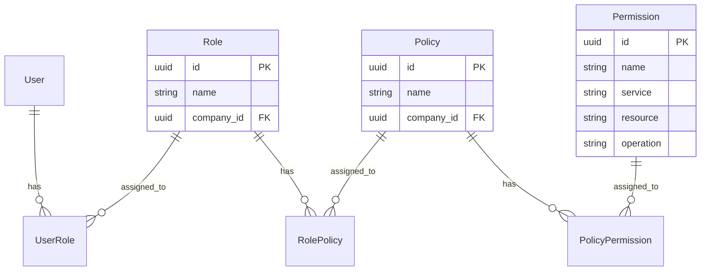
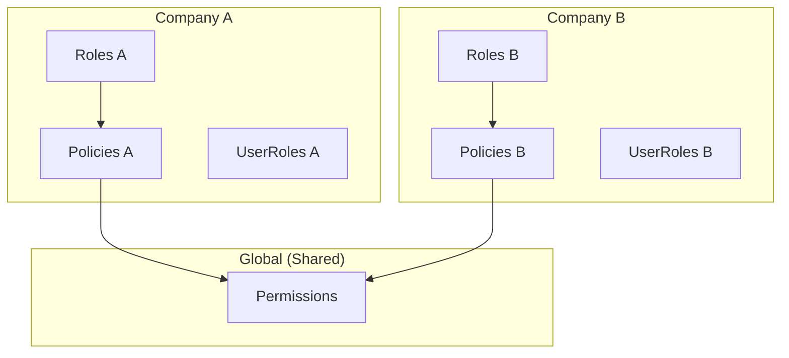
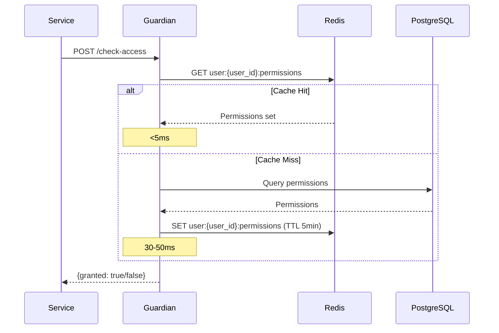
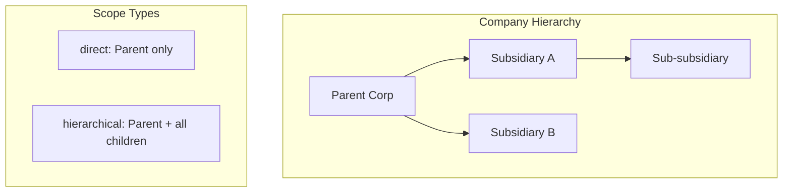
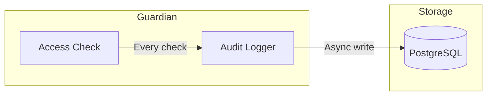

<div align="center">
  
</div>

# Waterfall Guardian Architecture

This document records key architecture decisions for the Guardian Authorization Service.

## Table of Contents

- [RBAC Model](#rbac-model)
- [Multi-Tenant Isolation](#multi-tenant-isolation)
- [Caching Strategy](#caching-strategy)
- [Scope Resolution](#scope-resolution)
- [Identity Integration](#identity-integration)
- [Audit Logging](#audit-logging)
- [Security Considerations](#security-considerations)
- [References](#references)

---

## RBAC Model

### Decision

Guardian implements a **Role → Policy → Permission** hierarchy with indirect permission assignment.

### Context

Options considered:

| Option | Pros | Cons |
|--------|------|------|
| **Direct Role → Permission** | Simple, fast queries | No reusable permission groups |
| **Role → Policy → Permission** | Reusable policies, flexible | More complex queries |
| **Attribute-Based (ABAC)** | Very flexible | Complex to implement and audit |

### Architecture



### Rationale

- **Policies as reusable groups**: Same policy can be attached to multiple roles
- **Clear separation**: Roles define "who", policies define "what permissions"
- **Audit-friendly**: Easy to answer "why does user X have permission Y?"

### Implications

- Permission checks require joins across 4-5 tables (optimized by caching)
- Policy changes propagate to all roles using that policy
- Cache invalidation must cascade through the hierarchy

---

## Multi-Tenant Isolation

### Decision

All RBAC entities (Roles, Policies, UserRoles) are **scoped by `company_id`**. Permissions are global.

### Context

Guardian serves multiple companies on the Waterfall platform. Each company must have isolated authorization without seeing other companies' data.

### Architecture



### Implementation

```python
# Every query is filtered by company_id from JWT
@app.before_request
def inject_company_context():
    g.company_id = get_jwt_claim("company_id")

# All queries automatically scoped
roles = Role.query.filter_by(company_id=g.company_id).all()
```

### Implications

- No cross-company data leakage possible at query level
- Permissions are seeded once, shared across all companies
- Company admins can only manage their own roles/policies

---

## Caching Strategy

### Decision

Use **Redis** for caching user permissions with **5-minute TTL** and **explicit invalidation**.

### Context

Access checks are called thousands of times per day. Database queries on every check would create unacceptable latency (50-100ms vs target <5ms).

### Architecture



### Cache Keys

| Key Pattern | TTL | Content |
|-------------|-----|---------|
| `user:{user_id}:permissions` | 5 min | Set of permission strings |
| `company:{company_id}:hierarchy` | 1 hour | Company parent chain |
| `permissions:all` | 1 hour | All system permissions |

### Invalidation Strategy

```python
# On role/policy change, invalidate affected users
def invalidate_role_cache(role_id):
    user_ids = UserRole.query.filter_by(role_id=role_id).values('user_id')
    for user_id in user_ids:
        redis.delete(f"user:{user_id}:permissions")
```

### Implications

- Cache hit rate target: >95%
- Stale permissions possible for up to 5 minutes after change
- Redis failure degrades to database (slower but functional)

---

## Scope Resolution

### Decision

Support **two scope types**: `direct` (exact match) and `hierarchical` (includes child companies).

### Context

Some roles apply only to one company, others should cascade to subsidiaries.

### Architecture



### Implementation

```python
def resolve_scope(user_id, target_company_id):
    user_roles = UserRole.query.filter_by(user_id=user_id).all()

    for role in user_roles:
        if role.scope_type == "direct":
            if role.company_id == target_company_id:
                yield role
        elif role.scope_type == "hierarchical":
            if is_ancestor_of(role.company_id, target_company_id):
                yield role
```

### Implications

- Hierarchical checks require company ancestry lookup (cached)
- Parent company admins can manage child companies
- Useful for corporate structures with subsidiaries

---

## Identity Integration

### Decision

Guardian **validates JWT signature** but **trusts claims**. User/company existence verified via Identity Service only when needed.

### Context

Options considered:

| Option | Pros | Cons |
|--------|------|------|
| **Call Identity on every request** | Real-time validation | +50ms latency per request |
| **Trust JWT claims** | Fast | Relies on JWT validity |
| **Cache Identity data locally** | Fast + validated | Sync complexity |

### Rationale

- JWT is signed by Identity Service with shared secret
- If signature is valid, claims are trustworthy
- User/company existence checked at token issuance time

### Implementation

```python
# JWT validation in Guardian
def validate_jwt(token):
    try:
        claims = jwt.decode(token, JWT_SECRET_KEY, algorithms=[JWT_ALGORITHM])
        # Claims are trusted if signature is valid
        return claims
    except jwt.InvalidTokenError:
        raise Unauthorized("Invalid token")

# Identity Service called only for:
# - Company hierarchy resolution (cached 1h)
# - User validation in admin operations
```

### Implications

- Deleted users retain access until JWT expires (typically 30min)
- Company hierarchy changes require cache invalidation
- No network dependency for standard access checks

---

## Audit Logging

### Decision

Log **all access check results** with full context for compliance and debugging.

### Context

Security and compliance requirements demand:
- Who accessed what, when
- Denied access attempts
- Permission change history

### Architecture



### Implementation

```python
class AccessLog:
    user_id: UUID
    company_id: UUID
    service: str
    resource_name: str
    operation: str
    access_granted: bool
    reason: str
    context: JSON  # Additional request context
    created_at: datetime
```

### Retention

| Environment | Retention |
|-------------|-----------|
| Production | 90 days |
| Staging | 30 days |
| Development | 7 days |

### Implications

- High write volume (consider partitioning for scale)
- GDPR compliance: purge endpoint available
- Useful for debugging "why was access denied?"

---

## Security Considerations

### Authentication

- **JWT validation**: Signature verified on every request
- **Internal token**: Service-to-service calls use `X-Internal-Token`
- **No session state**: Stateless authentication

### Authorization

- **Principle of least privilege**: Default deny
- **Company isolation**: All queries scoped by company_id
- **Audit trail**: All decisions logged

### Data Protection

- **No sensitive data in logs**: User IDs only, no PII
- **Encrypted at rest**: PostgreSQL with encryption
- **Encrypted in transit**: TLS required in production

---

## References

- [NIST RBAC Model](https://csrc.nist.gov/projects/role-based-access-control)
- [JWT Best Practices (RFC 8725)](https://datatracker.ietf.org/doc/html/rfc8725)
- [OWASP Authorization Cheat Sheet](https://cheatsheetseries.owasp.org/cheatsheets/Authorization_Cheat_Sheet.html)
- [Redis Caching Patterns](https://redis.io/docs/manual/patterns/)
