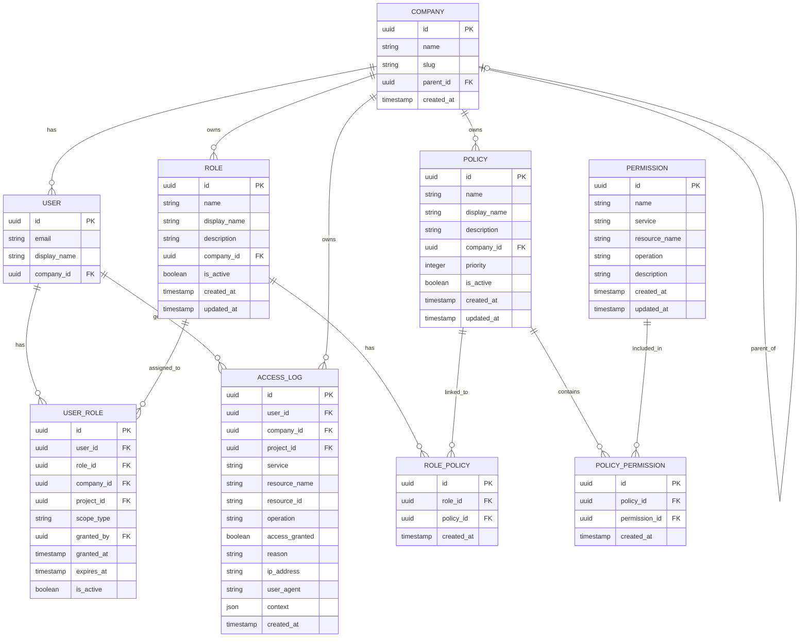

<div align="center">
  
</div>

# Waterfall Guardian Data Models

> Description of entities and relationships for the Guardian Authorization Service.

## Entity-Relationship Diagram



> **Note**: The `COMPANY` and `USER` entities are managed by the **Identity** service.
> The Guardian service only stores references (UUIDs) and manages authorization data.

---

## Entities

### Role

Represents a role that can be assigned to users. Roles are isolated by company and contain policies.

| Field | Type | Constraints | Description |
|-------|------|-------------|-------------|
| `id` | UUID | PK | Unique role identifier |
| `name` | string | NOT NULL, UNIQUE per company | Technical name (lowercase, underscores: `^[a-z_]+$`) |
| `display_name` | string | NOT NULL | Human-readable display name |
| `description` | string | NULLABLE | Role description |
| `company_id` | UUID | FK, NOT NULL | Owner company (from Identity) |
| `is_active` | boolean | NOT NULL, DEFAULT true | Whether the role is active |
| `created_at` | timestamp | NOT NULL | Creation date |
| `updated_at` | timestamp | NOT NULL | Last modification |

**Standard Roles (created at bootstrap):**

| Name | Display Name | Description |
|------|--------------|-------------|
| `company_admin` | Company Admin | Full access to all resources |
| `project_manager` | Project Manager | Project management permissions |
| `member` | Member | Standard project participation |
| `viewer` | Viewer | Read-only access |

---

### Policy

Represents a policy that groups permissions together. Policies are linked to roles.

| Field | Type | Constraints | Description |
|-------|------|-------------|-------------|
| `id` | UUID | PK | Unique policy identifier |
| `name` | string | NOT NULL, UNIQUE per company | Technical name (lowercase, underscores) |
| `display_name` | string | NOT NULL | Human-readable display name |
| `description` | string | NULLABLE | Policy description |
| `company_id` | UUID | FK, NOT NULL | Owner company (from Identity) |
| `priority` | integer | NOT NULL, DEFAULT 0 | Evaluation order (higher = first) |
| `is_active` | boolean | NOT NULL, DEFAULT true | Whether the policy is active |
| `permissions_count` | integer | COMPUTED | Number of attached permissions |
| `created_at` | timestamp | NOT NULL | Creation date |
| `updated_at` | timestamp | NOT NULL | Last modification |

---

### Permission

Represents a single permission (read-only, seeded by system at startup).

**Format:** `service:resource:operation`

| Field | Type | Constraints | Description |
|-------|------|-------------|-------------|
| `id` | UUID | PK | Unique permission identifier |
| `name` | string | NOT NULL, UNIQUE | Full permission name (`service:resource:operation`) |
| `service` | string | NOT NULL | Service identifier |
| `resource_name` | string | NOT NULL | Resource type identifier |
| `operation` | string | NOT NULL | Operation type |
| `description` | string | NULLABLE | Permission description |
| `created_at` | timestamp | NOT NULL | Creation date |
| `updated_at` | timestamp | NOT NULL | Last modification |

**Available Services:**

| Service | Description |
|---------|-------------|
| `identity` | User and company management |
| `storage` | File storage |
| `project` | Project management |
| `diagram` | Diagram editor |
| `requirement` | Requirements management |
| `system` | System configuration |
| `work` | Work packages |
| `budget` | Budget management |
| `timesheet` | Time tracking |
| `analytics` | Analytics and reports |
| `basic-io` | Basic I/O operations |
| `resources` | Resource management |

**Available Operations:**

| Operation | Description |
|-----------|-------------|
| `LIST` | List resources |
| `CREATE` | Create new resources |
| `READ` | Read resource details |
| `UPDATE` | Modify resources |
| `DELETE` | Delete resources |
| `APPROVE` | Approve workflows |
| `EXPORT` | Export data |
| `IMPORT` | Import data |

---

### UserRole

Represents the assignment of a role to a user, with scope information.

| Field | Type | Constraints | Description |
|-------|------|-------------|-------------|
| `id` | UUID | PK | Unique assignment identifier |
| `user_id` | UUID | FK, NOT NULL | Assigned user (from Identity) |
| `role_id` | UUID | FK, NOT NULL | Assigned role |
| `company_id` | UUID | FK, NOT NULL | Company scope |
| `project_id` | UUID | FK, NULLABLE | Project scope (NULL = company-wide) |
| `scope_type` | enum | NOT NULL | `direct` or `hierarchical` |
| `granted_by` | UUID | FK, NULLABLE | User who granted the role |
| `granted_at` | timestamp | NOT NULL | Grant date |
| `expires_at` | timestamp | NULLABLE | Expiration date (for temporary roles) |
| `is_active` | boolean | NOT NULL, DEFAULT true | Whether the assignment is active |

**Scope Types:**

| Type | Description |
|------|-------------|
| `direct` | Access only to exact `company_id` or `project_id` |
| `hierarchical` | Access to `company_id` + all child companies (via `parent_id`) |

**Scope Combinations:**

| project_id | scope_type | Meaning |
|------------|------------|---------|
| NULL | direct | Company-wide, exact company only |
| NULL | hierarchical | Company-wide + child companies |
| UUID | direct | Specific project only |

---

### RolePolicy

Join table linking roles to policies (many-to-many).

| Field | Type | Constraints | Description |
|-------|------|-------------|-------------|
| `id` | UUID | PK | Unique link identifier |
| `role_id` | UUID | FK, NOT NULL | Role |
| `policy_id` | UUID | FK, NOT NULL | Policy |
| `created_at` | timestamp | NOT NULL | Link creation date |

**Constraints:** UNIQUE (`role_id`, `policy_id`)

---

### PolicyPermission

Join table linking policies to permissions (many-to-many).

| Field | Type | Constraints | Description |
|-------|------|-------------|-------------|
| `id` | UUID | PK | Unique link identifier |
| `policy_id` | UUID | FK, NOT NULL | Policy |
| `permission_id` | UUID | FK, NOT NULL | Permission |
| `created_at` | timestamp | NOT NULL | Link creation date |

**Constraints:** UNIQUE (`policy_id`, `permission_id`)

---

### AccessLog

Audit log entry for access checks (security and compliance).

| Field | Type | Constraints | Description |
|-------|------|-------------|-------------|
| `id` | UUID | PK | Unique log identifier |
| `user_id` | UUID | FK, NOT NULL | User who made the request |
| `company_id` | UUID | FK, NOT NULL | User's company |
| `project_id` | UUID | FK, NULLABLE | Project context (if applicable) |
| `service` | string | NOT NULL | Requesting service |
| `resource_name` | string | NOT NULL | Resource type |
| `resource_id` | string | NULLABLE | Specific resource ID |
| `operation` | string | NOT NULL | Requested operation |
| `access_granted` | boolean | NOT NULL | Access granted (true) or denied (false) |
| `reason` | string | NULLABLE | Reason for decision |
| `ip_address` | string | NULLABLE | Request IP address |
| `user_agent` | string | NULLABLE | Request User-Agent |
| `context` | JSON | NULLABLE | Additional request context |
| `created_at` | timestamp | NOT NULL | Date/time of access attempt |

**Access Decision Reasons:**

| Reason | Description |
|--------|-------------|
| `granted` | Access was granted |
| `no_permission` | User lacks required permission |
| `no_matching_role` | No role matches request context |
| `role_expired` | User's role has expired |
| `role_inactive` | User's role is deactivated |
| `project_mismatch` | Role doesn't apply to requested project |
| `company_mismatch` | Role doesn't apply to target company |

---

## Enumerations

### ScopeType

```python
class ScopeType(str, Enum):
    DIRECT = "direct"           # Access only exact scope
    HIERARCHICAL = "hierarchical"  # Access scope + children
```

### Operation

```python
class Operation(str, Enum):
    LIST = "LIST"
    CREATE = "CREATE"
    READ = "READ"
    UPDATE = "UPDATE"
    DELETE = "DELETE"
    APPROVE = "APPROVE"
    EXPORT = "EXPORT"
    IMPORT = "IMPORT"
```

### AccessReason

```python
class AccessReason(str, Enum):
    GRANTED = "granted"
    NO_PERMISSION = "no_permission"
    NO_MATCHING_ROLE = "no_matching_role"
    ROLE_EXPIRED = "role_expired"
    ROLE_INACTIVE = "role_inactive"
    PROJECT_MISMATCH = "project_mismatch"
    COMPANY_MISMATCH = "company_mismatch"
```

---

## Recommended Indexes

```sql
-- Roles: search by company
CREATE INDEX idx_role_company ON role(company_id);
CREATE UNIQUE INDEX idx_role_company_name ON role(company_id, name);

-- Policies: search by company
CREATE INDEX idx_policy_company ON policy(company_id);
CREATE UNIQUE INDEX idx_policy_company_name ON policy(company_id, name);

-- Permissions: search by service/resource/operation
CREATE INDEX idx_permission_service ON permission(service);
CREATE INDEX idx_permission_service_resource ON permission(service, resource_name);
CREATE UNIQUE INDEX idx_permission_name ON permission(name);

-- UserRole: critical for access checks
CREATE INDEX idx_user_role_user ON user_role(user_id);
CREATE INDEX idx_user_role_user_company ON user_role(user_id, company_id);
CREATE INDEX idx_user_role_user_project ON user_role(user_id, project_id);
CREATE INDEX idx_user_role_role ON user_role(role_id);
CREATE INDEX idx_user_role_active ON user_role(user_id, is_active) WHERE is_active = true;

-- RolePolicy: join optimization
CREATE INDEX idx_role_policy_role ON role_policy(role_id);
CREATE INDEX idx_role_policy_policy ON role_policy(policy_id);
CREATE UNIQUE INDEX idx_role_policy_unique ON role_policy(role_id, policy_id);

-- PolicyPermission: join optimization
CREATE INDEX idx_policy_permission_policy ON policy_permission(policy_id);
CREATE INDEX idx_policy_permission_permission ON policy_permission(permission_id);
CREATE UNIQUE INDEX idx_policy_permission_unique ON policy_permission(policy_id, permission_id);

-- AccessLog: audit queries
CREATE INDEX idx_access_log_user ON access_log(user_id);
CREATE INDEX idx_access_log_company ON access_log(company_id);
CREATE INDEX idx_access_log_created ON access_log(created_at DESC);
CREATE INDEX idx_access_log_granted ON access_log(access_granted);
CREATE INDEX idx_access_log_service ON access_log(service);
CREATE INDEX idx_access_log_company_date ON access_log(company_id, created_at DESC);
```

---

## Caching Strategy

Guardian uses Redis for high-performance caching:

| Cache Key Pattern | TTL | Description |
|-------------------|-----|-------------|
| `user:{user_id}:permissions` | 5 min | User's computed permissions |
| `user:{user_id}:roles` | 5 min | User's active roles |
| `company:{company_id}:hierarchy` | 1 hour | Company hierarchy (parent/children) |
| `permission:all` | 1 hour | All system permissions |

**Cache Invalidation Triggers:**
- UserRole created/updated/deleted
- Role policies modified
- Policy permissions modified
- Role/Policy activated/deactivated

---

## Data Flow

### Access Check Flow

```
1. Request: POST /check-access {service, resource, operation, context}
2. Extract user_id, company_id from JWT
3. Check Redis cache for user permissions
4. If cache miss:
   a. Query UserRoles for user (active, non-expired)
   b. Apply scope filtering (company_id, project_id, scope_type)
   c. Get Policies via RolePolicy joins
   d. Get Permissions via PolicyPermission joins
   e. Cache result in Redis
5. Check if required permission exists
6. Log to AccessLog (async)
7. Return {access_granted, reason, matched_role}
```

### Permission Resolution

```
User → UserRole(s) → Role(s) → RolePolicy → Policy(ies) → PolicyPermission → Permission(s)
```

**Filtering at each step:**
- UserRole: `is_active=true`, `expires_at > now()`, scope matches
- Role: `is_active=true`
- Policy: `is_active=true`
