<div align="center">
  
</div>

# Waterfall Guardian Monitoring

This document describes the monitoring strategy for the Guardian Authorization Service, including Prometheus metrics, Grafana dashboards, and alerting rules.

## Table of Contents

- [Waterfall Guardian Monitoring](#waterfall-guardian-monitoring)
  - [Table of Contents](#table-of-contents)
  - [Overview](#overview)
  - [Metrics Architecture](#metrics-architecture)
  - [Standard Flask Metrics](#standard-flask-metrics)
  - [Guardian Core Metrics](#guardian-core-metrics)
    - [Access Control Metrics](#access-control-metrics)
    - [Scope Resolution Metrics](#scope-resolution-metrics)
  - [Cache Metrics](#cache-metrics)
    - [Cache Operations](#cache-operations)
    - [Cache Performance](#cache-performance)
  - [Security Metrics](#security-metrics)
    - [Authentication Metrics](#authentication-metrics)
    - [Authorization Metrics](#authorization-metrics)
    - [Rate Limiting Metrics](#rate-limiting-metrics)
  - [RBAC Operations Metrics](#rbac-operations-metrics)
    - [Role Management](#role-management)
    - [Policy Management](#policy-management)
    - [Permission Management](#permission-management)
    - [User Role Assignment](#user-role-assignment)
  - [Audit Metrics](#audit-metrics)
  - [Database Metrics](#database-metrics)
  - [External Services Metrics](#external-services-metrics)
  - [Key Performance Indicators (KPIs)](#key-performance-indicators-kpis)
  - [Prometheus Alerting Rules](#prometheus-alerting-rules)
    - [Critical Alerts](#critical-alerts)
    - [Warning Alerts](#warning-alerts)
    - [Security Alerts](#security-alerts)
  - [Grafana Dashboards](#grafana-dashboards)
    - [Dashboard Overview](#dashboard-overview)
    - [Row 1: Service Health](#row-1-service-health)
    - [Row 2: Access Control Performance](#row-2-access-control-performance)
    - [Row 3: Cache Performance](#row-3-cache-performance)
    - [Row 4: Security Overview](#row-4-security-overview)
    - [Row 5: RBAC Operations](#row-5-rbac-operations)
    - [Row 6: Database Performance](#row-6-database-performance)
  - [PromQL Query Examples](#promql-query-examples)
    - [Access Control Queries](#access-control-queries)
    - [Cache Performance Queries](#cache-performance-queries)
    - [Security Queries](#security-queries)
    - [Capacity Planning Queries](#capacity-planning-queries)
  - [Setup](#setup)
    - [Prometheus Configuration](#prometheus-configuration)
    - [Docker Compose](#docker-compose)
    - [Environment Variables](#environment-variables)
  - [Best Practices](#best-practices)
    - [Retention Policy](#retention-policy)
    - [Cardinality Management](#cardinality-management)
  - [Runbook References](#runbook-references)
  - [See Also](#see-also)

---

## Overview

The Guardian Authorization Service exposes metrics at the `/metrics` endpoint in Prometheus format. As a critical security service, comprehensive monitoring is essential for:

- **Performance monitoring**: Track access check latency (target: <5ms with cache)
- **Security monitoring**: Detect authentication failures, permission denials, and anomalous patterns
- **Cache effectiveness**: Monitor hit rates to ensure optimal performance
- **RBAC operations**: Track role, policy, and permission management activities
- **Audit compliance**: Monitor audit log generation and storage
- **Capacity planning**: Anticipate scaling needs based on access check volume

---

## Metrics Architecture

```mermaid
flowchart TB
    subgraph guardian["Guardian Service"]
        subgraph metrics_sources["Metrics Sources"]
            access["🎯 Access Control<br/>Metrics"]
            cache["💾 Cache<br/>Metrics"]
            security["🔒 Security<br/>Metrics"]
            rbac["👥 RBAC<br/>Metrics"]
            audit["📝 Audit<br/>Metrics"]
            db["🗄️ Database<br/>Metrics"]
        end

        exporter["Prometheus Exporter<br/>/metrics endpoint"]

        access --> exporter
        cache --> exporter
        security --> exporter
        rbac --> exporter
        audit --> exporter
        db --> exporter
    end

    subgraph monitoring["Monitoring Stack"]
        prometheus["Prometheus<br/>⏱️ Scrape every 15s<br/>📊 Store & Query"]
        alertmanager["AlertManager<br/>🚨 Alert Routing<br/>📧 Notifications"]
        grafana["Grafana<br/>📈 Dashboards<br/>🔔 Alerting"]
    end

    subgraph notifications["Notification Channels"]
        slack["Slack"]
        email["Email"]
        pagerduty["PagerDuty"]
    end

    exporter -->|"HTTP GET /metrics"| prometheus
    prometheus -->|"Alert Rules"| alertmanager
    prometheus -->|"PromQL Queries"| grafana
    alertmanager --> slack
    alertmanager --> email
    alertmanager --> pagerduty

    style guardian fill:#e8f4ea,stroke:#2e7d32
    style monitoring fill:#e3f2fd,stroke:#1565c0
    style notifications fill:#fff3e0,stroke:#ef6c00
    style exporter fill:#c8e6c9,stroke:#2e7d32
    style prometheus fill:#bbdefb,stroke:#1565c0
    style grafana fill:#bbdefb,stroke:#1565c0
    style alertmanager fill:#bbdefb,stroke:#1565c0
```



---

## Standard Flask Metrics

The service includes standard Flask/Prometheus metrics provided by `prometheus-flask-exporter`:

| Metric | Type | Description |
|--------|------|-------------|
| `flask_http_request_duration_seconds` | Histogram | HTTP request latency by endpoint |
| `flask_http_request_total` | Counter | Total HTTP requests (by method, status, path) |
| `flask_http_request_exceptions_total` | Counter | Total unhandled exceptions |
| `process_cpu_seconds_total` | Counter | Total CPU time consumed |
| `process_resident_memory_bytes` | Gauge | Current memory usage (RSS) |
| `process_open_fds` | Gauge | Number of open file descriptors |
| `python_gc_objects_collected_total` | Counter | Objects collected by garbage collector |
| `python_info` | Gauge | Python version information |

---

## Guardian Core Metrics

### Access Control Metrics

These are the most critical metrics for Guardian's primary function.

| Metric | Type | Labels | Description |
|--------|------|--------|-------------|
| `guardian_access_check_total` | Counter | `result`, `resource`, `action` | Total access checks performed |
| `guardian_access_check_duration_seconds` | Histogram | `cache_hit`, `scope` | Access check latency |
| `guardian_batch_access_check_total` | Counter | `result` | Total batch access checks |
| `guardian_batch_access_check_size` | Histogram | - | Number of permissions per batch request |
| `guardian_batch_access_check_duration_seconds` | Histogram | - | Batch check total duration |

**Labels for `guardian_access_check_total`:**
- `result`: `granted`, `denied`
- `resource`: Resource being accessed (e.g., `users`, `companies`, `reports`)
- `action`: Action being performed (e.g., `read`, `write`, `delete`, `admin`)

**Labels for `guardian_access_check_duration_seconds`:**
- `cache_hit`: `true`, `false`
- `scope`: `direct`, `hierarchical`

### Scope Resolution Metrics

| Metric | Type | Labels | Description |
|--------|------|--------|-------------|
| `guardian_scope_resolution_total` | Counter | `scope_type`, `result` | Scope resolution operations |
| `guardian_scope_resolution_duration_seconds` | Histogram | `scope_type` | Scope resolution latency |
| `guardian_hierarchy_depth` | Histogram | - | Depth of hierarchy traversal |

**Labels:**
- `scope_type`: `direct`, `hierarchical`, `wildcard`
- `result`: `resolved`, `not_found`, `error`

---

## Cache Metrics

### Cache Operations

| Metric | Type | Labels | Description |
|--------|------|--------|-------------|
| `guardian_cache_operations_total` | Counter | `operation`, `cache_type`, `result` | Cache operations count |
| `guardian_cache_operation_duration_seconds` | Histogram | `operation`, `cache_type` | Cache operation latency |
| `guardian_cache_entries` | Gauge | `cache_type` | Current number of cached entries |
| `guardian_cache_memory_bytes` | Gauge | `cache_type` | Estimated memory usage by cache |

**Labels:**
- `operation`: `get`, `set`, `delete`, `invalidate`, `bulk_invalidate`
- `cache_type`: `user_permissions`, `company_hierarchy`, `all_permissions`, `role_policies`
- `result`: `hit`, `miss`, `error`, `expired`

### Cache Performance

| Metric | Type | Labels | Description |
|--------|------|--------|-------------|
| `guardian_cache_hit_total` | Counter | `cache_type` | Total cache hits |
| `guardian_cache_miss_total` | Counter | `cache_type` | Total cache misses |
| `guardian_cache_invalidation_total` | Counter | `cache_type`, `reason` | Cache invalidations |
| `guardian_cache_ttl_seconds` | Gauge | `cache_type` | Current TTL configuration |

**Invalidation reasons:**
- `reason`: `manual`, `role_change`, `policy_change`, `permission_change`, `user_role_change`, `expiry`

**Cache TTL defaults:**

| Cache Type | TTL | Description |
|------------|-----|-------------|
| `user_permissions` | 300s (5min) | Per-user permission cache |
| `company_hierarchy` | 3600s (1h) | Company hierarchy structure |
| `all_permissions` | 3600s (1h) | Complete permission list |
| `role_policies` | 3600s (1h) | Role to policy mappings |

---

## Security Metrics

### Authentication Metrics

| Metric | Type | Labels | Description |
|--------|------|--------|-------------|
| `guardian_auth_total` | Counter | `method`, `result` | Authentication attempts |
| `guardian_auth_failure_total` | Counter | `method`, `reason` | Authentication failures |
| `guardian_token_validation_duration_seconds` | Histogram | `method` | Token validation latency |

**Labels:**
- `method`: `jwt`, `internal_token`, `api_key`
- `result`: `success`, `failure`
- `reason`: `invalid_token`, `expired_token`, `missing_token`, `invalid_signature`, `malformed`, `missing_claims`

### Authorization Metrics

| Metric | Type | Labels | Description |
|--------|------|--------|-------------|
| `guardian_permission_denied_total` | Counter | `resource`, `action`, `reason` | Permission denials |
| `guardian_unauthorized_access_attempt_total` | Counter | `endpoint`, `method` | Unauthorized access attempts |
| `guardian_privilege_escalation_attempt_total` | Counter | `user_id`, `target_role` | Privilege escalation attempts |

**Denial reasons:**
- `reason`: `no_permission`, `scope_mismatch`, `company_mismatch`, `role_inactive`, `policy_inactive`

### Rate Limiting Metrics

| Metric | Type | Labels | Description |
|--------|------|--------|-------------|
| `guardian_rate_limit_total` | Counter | `endpoint`, `result` | Rate limit checks |
| `guardian_rate_limit_exceeded_total` | Counter | `endpoint`, `client_id` | Rate limit violations |
| `guardian_rate_limit_remaining` | Gauge | `endpoint`, `client_id` | Remaining requests in window |

---

## RBAC Operations Metrics

### Role Management

| Metric | Type | Labels | Description |
|--------|------|--------|-------------|
| `guardian_role_operations_total` | Counter | `operation`, `result` | Role CRUD operations |
| `guardian_role_operation_duration_seconds` | Histogram | `operation` | Role operation latency |
| `guardian_roles_total` | Gauge | `company_id`, `status` | Total roles by company |
| `guardian_role_policy_assignments_total` | Counter | `operation` | Role-policy link operations |

**Labels:**
- `operation`: `create`, `read`, `update`, `delete`, `list`, `assign_policy`, `remove_policy`
- `result`: `success`, `failure`, `not_found`, `conflict`
- `status`: `active`, `inactive`

### Policy Management

| Metric | Type | Labels | Description |
|--------|------|--------|-------------|
| `guardian_policy_operations_total` | Counter | `operation`, `result` | Policy CRUD operations |
| `guardian_policy_operation_duration_seconds` | Histogram | `operation` | Policy operation latency |
| `guardian_policies_total` | Gauge | `company_id`, `status` | Total policies by company |
| `guardian_policy_permission_assignments_total` | Counter | `operation` | Policy-permission link operations |

### Permission Management

| Metric | Type | Labels | Description |
|--------|------|--------|-------------|
| `guardian_permission_operations_total` | Counter | `operation`, `result` | Permission CRUD operations |
| `guardian_permission_operation_duration_seconds` | Histogram | `operation` | Permission operation latency |
| `guardian_permissions_total` | Gauge | `resource`, `action` | Total permissions by resource/action |
| `guardian_permission_seeding_total` | Counter | `result` | Permission seeding operations |
| `guardian_permission_seeding_duration_seconds` | Histogram | - | Permission seeding latency |

### User Role Assignment

| Metric | Type | Labels | Description |
|--------|------|--------|-------------|
| `guardian_user_role_operations_total` | Counter | `operation`, `result` | User role assignment operations |
| `guardian_user_role_operation_duration_seconds` | Histogram | `operation` | Assignment operation latency |
| `guardian_user_roles_total` | Gauge | `company_id`, `role_name` | User role assignments by company |
| `guardian_users_with_roles_total` | Gauge | `company_id` | Users with at least one role |

---

## Audit Metrics

| Metric | Type | Labels | Description |
|--------|------|--------|-------------|
| `guardian_audit_log_total` | Counter | `action`, `resource`, `result` | Audit log entries created |
| `guardian_audit_log_write_duration_seconds` | Histogram | - | Audit log write latency |
| `guardian_audit_log_query_duration_seconds` | Histogram | `query_type` | Audit log query latency |
| `guardian_audit_log_size_bytes` | Gauge | - | Total audit log storage size |
| `guardian_audit_retention_deleted_total` | Counter | - | Records deleted by retention policy |

**Labels:**
- `action`: `access_check`, `role_create`, `role_update`, `role_delete`, `policy_assign`, `user_role_assign`, etc.
- `resource`: `role`, `policy`, `permission`, `user_role`, `access`
- `result`: `success`, `failure`
- `query_type`: `by_user`, `by_company`, `by_resource`, `by_date_range`

---

## Database Metrics

| Metric | Type | Labels | Description |
|--------|------|--------|-------------|
| `guardian_db_query_total` | Counter | `query_type`, `table` | Total database queries |
| `guardian_db_query_duration_seconds` | Histogram | `query_type`, `table` | Query execution time |
| `guardian_db_connection_pool_size` | Gauge | `state` | Connection pool status |
| `guardian_db_connection_wait_seconds` | Histogram | - | Time waiting for connection |
| `guardian_db_transaction_total` | Counter | `result` | Database transactions |
| `guardian_db_deadlock_total` | Counter | - | Deadlock occurrences |

**Labels:**
- `query_type`: `select`, `insert`, `update`, `delete`
- `table`: `roles`, `policies`, `permissions`, `user_roles`, `role_policies`, `policy_permissions`, `access_logs`
- `state`: `active`, `idle`, `waiting`
- `result`: `committed`, `rolled_back`

---

## External Services Metrics

| Metric | Type | Labels | Description |
|--------|------|--------|-------------|
| `guardian_external_service_request_total` | Counter | `service`, `endpoint`, `result` | External service calls |
| `guardian_external_service_duration_seconds` | Histogram | `service`, `endpoint` | External call latency |
| `guardian_external_service_circuit_breaker_state` | Gauge | `service` | Circuit breaker status (0=closed, 1=open, 0.5=half-open) |
| `guardian_external_service_retry_total` | Counter | `service`, `attempt` | Retry attempts |

**Labels:**
- `service`: `identity`
- `endpoint`: `validate_token`, `get_user`, `get_company`
- `result`: `success`, `failure`, `timeout`

---

## Key Performance Indicators (KPIs)

The following KPIs should be monitored for Guardian service health:

| KPI | Target | Critical Threshold | Description |
|-----|--------|-------------------|-------------|
| Access Check Latency (P99) | < 5ms (cached) | > 50ms | Primary SLA metric |
| Access Check Latency (P99) | < 50ms (uncached) | > 200ms | Without cache |
| Cache Hit Rate | > 95% | < 80% | Cache effectiveness |
| Authentication Success Rate | > 99.9% | < 99% | Auth reliability |
| Permission Grant Rate | N/A (business dependent) | Sudden changes | Anomaly detection |
| Error Rate (5xx) | < 0.1% | > 1% | Service stability |
| Rate Limit Violations | < 1% of requests | > 5% | Client behavior |
| Database Query Latency (P95) | < 10ms | > 100ms | DB performance |
| Audit Log Write Latency | < 5ms | > 50ms | Audit reliability |

---

## Prometheus Alerting Rules

### Critical Alerts

```yaml
groups:
  - name: guardian-critical
    rules:
      # ============================================
      # Service Availability
      # ============================================

      - alert: GuardianDown
        expr: up{job="guardian"} == 0
        for: 1m
        labels:
          severity: critical
          service: guardian
        annotations:
          summary: "Guardian Authorization Service is down"
          description: "Guardian has been unreachable for more than 1 minute. All authorization checks are failing."
          runbook_url: "https://wiki.waterfall.pro/runbooks/guardian-down"

      - alert: GuardianHighErrorRate
        expr: |
          sum(rate(flask_http_request_total{job="guardian",status=~"5.."}[5m]))
          / sum(rate(flask_http_request_total{job="guardian"}[5m])) > 0.01
        for: 2m
        labels:
          severity: critical
          service: guardian
        annotations:
          summary: "Guardian error rate exceeds 1%"
          description: "Guardian is returning {{ $value | humanizePercentage }} 5xx errors."

      # ============================================
      # Access Control Performance
      # ============================================

      - alert: GuardianAccessCheckLatencyHigh
        expr: |
          histogram_quantile(0.99,
            sum(rate(guardian_access_check_duration_seconds_bucket{cache_hit="true"}[5m])) by (le)
          ) > 0.005
        for: 5m
        labels:
          severity: critical
          service: guardian
        annotations:
          summary: "Guardian cached access check P99 latency > 5ms"
          description: "Access check P99 latency is {{ $value | humanizeDuration }}. Target is <5ms for cached requests."

      - alert: GuardianAccessCheckLatencyUncachedHigh
        expr: |
          histogram_quantile(0.99,
            sum(rate(guardian_access_check_duration_seconds_bucket{cache_hit="false"}[5m])) by (le)
          ) > 0.2
        for: 5m
        labels:
          severity: critical
          service: guardian
        annotations:
          summary: "Guardian uncached access check P99 latency > 200ms"
          description: "Uncached access check P99 latency is {{ $value | humanizeDuration }}."

      # ============================================
      # Cache Critical
      # ============================================

      - alert: GuardianCacheDown
        expr: |
          sum(rate(guardian_cache_operations_total{result="error"}[5m]))
          / sum(rate(guardian_cache_operations_total[5m])) > 0.5
        for: 2m
        labels:
          severity: critical
          service: guardian
        annotations:
          summary: "Guardian cache error rate > 50%"
          description: "Redis cache is likely down or unreachable. All requests hitting database."

      # ============================================
      # Database Critical
      # ============================================

      - alert: GuardianDatabaseDown
        expr: |
          sum(rate(guardian_db_query_total{result="error"}[5m]))
          / sum(rate(guardian_db_query_total[5m])) > 0.5
        for: 1m
        labels:
          severity: critical
          service: guardian
        annotations:
          summary: "Guardian database error rate > 50%"
          description: "Database connection issues detected. Service may be non-functional."

      - alert: GuardianDatabaseConnectionPoolExhausted
        expr: guardian_db_connection_pool_size{state="waiting"} > 5
        for: 2m
        labels:
          severity: critical
          service: guardian
        annotations:
          summary: "Guardian database connection pool exhausted"
          description: "{{ $value }} queries waiting for database connections."
```

### Warning Alerts

```yaml
  - name: guardian-warning
    rules:
      # ============================================
      # Cache Performance
      # ============================================

      - alert: GuardianCacheHitRateLow
        expr: |
          sum(rate(guardian_cache_hit_total[5m]))
          / (sum(rate(guardian_cache_hit_total[5m])) + sum(rate(guardian_cache_miss_total[5m]))) < 0.8
        for: 10m
        labels:
          severity: warning
          service: guardian
        annotations:
          summary: "Guardian cache hit rate below 80%"
          description: "Cache hit rate is {{ $value | humanizePercentage }}. Check for cache invalidation storms or TTL configuration."

      - alert: GuardianCacheInvalidationSpike
        expr: |
          sum(rate(guardian_cache_invalidation_total[5m])) > 100
        for: 5m
        labels:
          severity: warning
          service: guardian
        annotations:
          summary: "High cache invalidation rate"
          description: "{{ $value }} cache invalidations/second. Possible RBAC configuration churn."

      # ============================================
      # Performance Warnings
      # ============================================

      - alert: GuardianSlowDatabaseQueries
        expr: |
          histogram_quantile(0.95,
            sum(rate(guardian_db_query_duration_seconds_bucket[5m])) by (le)
          ) > 0.1
        for: 5m
        labels:
          severity: warning
          service: guardian
        annotations:
          summary: "Guardian database query P95 latency > 100ms"
          description: "Database queries are slow. Check for missing indexes or connection pool issues."

      - alert: GuardianHighRequestRate
        expr: |
          sum(rate(flask_http_request_total{job="guardian"}[5m])) > 1000
        for: 5m
        labels:
          severity: warning
          service: guardian
        annotations:
          summary: "Guardian request rate exceeds 1000/s"
          description: "High request volume: {{ $value }}/s. Consider scaling."

      # ============================================
      # Resource Warnings
      # ============================================

      - alert: GuardianHighMemoryUsage
        expr: |
          process_resident_memory_bytes{job="guardian"} > 1073741824
        for: 10m
        labels:
          severity: warning
          service: guardian
        annotations:
          summary: "Guardian memory usage exceeds 1GB"
          description: "Memory usage is {{ $value | humanize1024 }}B."

      - alert: GuardianAuditLogGrowth
        expr: |
          rate(guardian_audit_log_size_bytes[1h]) > 10485760
        for: 30m
        labels:
          severity: warning
          service: guardian
        annotations:
          summary: "Audit log growing > 10MB/hour"
          description: "Consider implementing log rotation or archival."
```

### Security Alerts

```yaml
  - name: guardian-security
    rules:
      # ============================================
      # Authentication Security
      # ============================================

      - alert: GuardianHighAuthFailureRate
        expr: |
          sum(rate(guardian_auth_failure_total[5m])) > 10
        for: 2m
        labels:
          severity: warning
          service: guardian
          category: security
        annotations:
          summary: "High authentication failure rate"
          description: "{{ $value }} auth failures/second. Possible brute force attack."

      - alert: GuardianInvalidTokenSpike
        expr: |
          sum(rate(guardian_auth_failure_total{reason="invalid_token"}[5m])) > 50
        for: 1m
        labels:
          severity: critical
          service: guardian
          category: security
        annotations:
          summary: "Spike in invalid token attempts"
          description: "{{ $value }} invalid tokens/second. Possible token forgery attempt."

      - alert: GuardianExpiredTokenSpike
        expr: |
          sum(rate(guardian_auth_failure_total{reason="expired_token"}[5m])) > 100
        for: 5m
        labels:
          severity: warning
          service: guardian
          category: security
        annotations:
          summary: "High rate of expired tokens"
          description: "{{ $value }} expired tokens/second. Check client token refresh logic."

      # ============================================
      # Authorization Security
      # ============================================

      - alert: GuardianPermissionDenialSpike
        expr: |
          sum(rate(guardian_permission_denied_total[5m]))
          / sum(rate(guardian_access_check_total[5m])) > 0.3
        for: 5m
        labels:
          severity: warning
          service: guardian
          category: security
        annotations:
          summary: "Permission denial rate exceeds 30%"
          description: "{{ $value | humanizePercentage }} of access checks are denied. Check for misconfiguration or unauthorized access attempts."

      - alert: GuardianPrivilegeEscalationAttempt
        expr: |
          sum(rate(guardian_privilege_escalation_attempt_total[5m])) > 0
        for: 0m
        labels:
          severity: critical
          service: guardian
          category: security
        annotations:
          summary: "Privilege escalation attempt detected"
          description: "User attempted to assign higher privileges. Investigate immediately."

      - alert: GuardianUnauthorizedAccessSpike
        expr: |
          sum(rate(guardian_unauthorized_access_attempt_total[5m])) > 20
        for: 2m
        labels:
          severity: warning
          service: guardian
          category: security
        annotations:
          summary: "High rate of unauthorized access attempts"
          description: "{{ $value }} unauthorized attempts/second."

      # ============================================
      # Rate Limiting Security
      # ============================================

      - alert: GuardianRateLimitViolations
        expr: |
          sum(rate(guardian_rate_limit_exceeded_total[5m])) > 10
        for: 2m
        labels:
          severity: warning
          service: guardian
          category: security
        annotations:
          summary: "High rate limit violation rate"
          description: "{{ $value }} rate limit violations/second. Possible DoS attempt."

      # ============================================
      # Anomaly Detection
      # ============================================

      - alert: GuardianAccessPatternAnomaly
        expr: |
          abs(
            sum(rate(guardian_access_check_total{result="granted"}[5m]))
            - sum(rate(guardian_access_check_total{result="granted"}[5m] offset 1d))
          ) / sum(rate(guardian_access_check_total{result="granted"}[5m] offset 1d)) > 0.5
        for: 15m
        labels:
          severity: warning
          service: guardian
          category: security
        annotations:
          summary: "Unusual access pattern detected"
          description: "Access grant rate changed by {{ $value | humanizePercentage }} compared to yesterday."
```

---

## Grafana Dashboards

### Dashboard Overview

The Guardian Grafana dashboard provides real-time visibility into service health, performance, and security.

**Dashboard ID**: `guardian-main`
**Refresh interval**: 30s
**Time range**: Last 1 hour (default)

### Row 1: Service Health

| Panel | Type | Query | Description |
|-------|------|-------|-------------|
| Request Rate | Graph | `rate(flask_http_request_total{job="guardian"}[5m])` | Requests per second |
| Error Rate | Graph | `rate(flask_http_request_total{job="guardian",status=~"5.."}[5m])` | 5xx errors per second |
| Latency P50/P95/P99 | Graph | `histogram_quantile(0.95, rate(flask_http_request_duration_seconds_bucket[5m]))` | Request latency percentiles |
| Active Instances | Stat | `count(up{job="guardian"} == 1)` | Number of healthy instances |
| Uptime | Stat | `time() - process_start_time_seconds{job="guardian"}` | Service uptime |

### Row 2: Access Control Performance

| Panel | Type | Query | Description |
|-------|------|-------|-------------|
| Access Checks/s | Graph | `sum(rate(guardian_access_check_total[5m])) by (result)` | Access checks by result |
| Access Check Latency | Heatmap | `rate(guardian_access_check_duration_seconds_bucket[5m])` | Latency distribution |
| Grant/Deny Ratio | Pie | `sum(guardian_access_check_total) by (result)` | Overall grant vs deny |
| Batch Check Size | Histogram | `rate(guardian_batch_access_check_size_bucket[5m])` | Batch request sizes |
| Scope Resolution | Graph | `sum(rate(guardian_scope_resolution_total[5m])) by (scope_type)` | Direct vs hierarchical |

### Row 3: Cache Performance

| Panel | Type | Query | Description |
|-------|------|-------|-------------|
| Cache Hit Rate | Gauge | `sum(rate(guardian_cache_hit_total[5m])) / (sum(rate(guardian_cache_hit_total[5m])) + sum(rate(guardian_cache_miss_total[5m])))` | Overall cache effectiveness |
| Cache Hit/Miss | Graph | `sum(rate(guardian_cache_hit_total[5m])) by (cache_type)` | Hits by cache type |
| Cache Latency | Graph | `histogram_quantile(0.95, rate(guardian_cache_operation_duration_seconds_bucket[5m]))` | Redis operation latency |
| Cache Invalidations | Graph | `sum(rate(guardian_cache_invalidation_total[5m])) by (reason)` | Invalidations by reason |
| Cache Entries | Stat | `sum(guardian_cache_entries) by (cache_type)` | Current cache size |

### Row 4: Security Overview

| Panel | Type | Query | Description |
|-------|------|-------|-------------|
| Auth Success Rate | Gauge | `sum(rate(guardian_auth_total{result="success"}[5m])) / sum(rate(guardian_auth_total[5m]))` | Authentication success rate |
| Auth Failures | Graph | `sum(rate(guardian_auth_failure_total[5m])) by (reason)` | Failures by reason |
| Permission Denials | Graph | `sum(rate(guardian_permission_denied_total[5m])) by (resource)` | Denials by resource |
| Rate Limit Hits | Graph | `sum(rate(guardian_rate_limit_exceeded_total[5m])) by (endpoint)` | Rate limits by endpoint |
| Security Events | Table | Various security metrics | Recent security events |

### Row 5: RBAC Operations

| Panel | Type | Query | Description |
|-------|------|-------|-------------|
| Role Operations | Graph | `sum(rate(guardian_role_operations_total[5m])) by (operation)` | Role CRUD activity |
| Policy Operations | Graph | `sum(rate(guardian_policy_operations_total[5m])) by (operation)` | Policy CRUD activity |
| User Role Assignments | Graph | `sum(rate(guardian_user_role_operations_total[5m])) by (operation)` | Assignment activity |
| Total Roles | Stat | `sum(guardian_roles_total{status="active"})` | Active roles count |
| Total Policies | Stat | `sum(guardian_policies_total{status="active"})` | Active policies count |
| Total Permissions | Stat | `sum(guardian_permissions_total)` | Total permissions |

### Row 6: Database Performance

| Panel | Type | Query | Description |
|-------|------|-------|-------------|
| Query Rate | Graph | `sum(rate(guardian_db_query_total[5m])) by (query_type)` | Queries by type |
| Query Latency | Graph | `histogram_quantile(0.95, rate(guardian_db_query_duration_seconds_bucket[5m])) by (table)` | Latency by table |
| Connection Pool | Gauge | `guardian_db_connection_pool_size` | Pool utilization |
| Transactions | Graph | `sum(rate(guardian_db_transaction_total[5m])) by (result)` | Commits vs rollbacks |
| Audit Log Size | Graph | `guardian_audit_log_size_bytes` | Audit storage growth |

---

## PromQL Query Examples

### Access Control Queries

```promql
# Access check success rate (last 5 minutes)
sum(rate(guardian_access_check_total{result="granted"}[5m]))
/ sum(rate(guardian_access_check_total[5m]))

# P99 latency for cached access checks
histogram_quantile(0.99,
  sum(rate(guardian_access_check_duration_seconds_bucket{cache_hit="true"}[5m])) by (le)
)

# Most denied resources
topk(10, sum(rate(guardian_permission_denied_total[1h])) by (resource))

# Access checks per user (top 10)
topk(10, sum(rate(guardian_access_check_total[1h])) by (user_id))

# Hierarchical vs direct scope ratio
sum(rate(guardian_scope_resolution_total{scope_type="hierarchical"}[5m]))
/ sum(rate(guardian_scope_resolution_total{scope_type="direct"}[5m]))
```

### Cache Performance Queries

```promql
# Overall cache hit rate
sum(rate(guardian_cache_hit_total[5m]))
/ (sum(rate(guardian_cache_hit_total[5m])) + sum(rate(guardian_cache_miss_total[5m])))

# Cache hit rate by type
sum(rate(guardian_cache_hit_total[5m])) by (cache_type)
/ (sum(rate(guardian_cache_hit_total[5m])) by (cache_type) + sum(rate(guardian_cache_miss_total[5m])) by (cache_type))

# Cache operation latency P95
histogram_quantile(0.95, sum(rate(guardian_cache_operation_duration_seconds_bucket[5m])) by (le, operation))

# Invalidation rate by reason
sum(rate(guardian_cache_invalidation_total[5m])) by (reason)

# Estimated cache memory per type
sum(guardian_cache_memory_bytes) by (cache_type)
```

### Security Queries

```promql
# Authentication failure rate
sum(rate(guardian_auth_failure_total[5m])) / sum(rate(guardian_auth_total[5m]))

# Top authentication failure reasons
topk(5, sum(rate(guardian_auth_failure_total[1h])) by (reason))

# Permission denial rate by resource
sum(rate(guardian_permission_denied_total[5m])) by (resource)
/ sum(rate(guardian_access_check_total[5m])) by (resource)

# Rate limit violations by client
topk(10, sum(rate(guardian_rate_limit_exceeded_total[1h])) by (client_id))

# Security events timeline
sum(rate(guardian_auth_failure_total[5m])) + sum(rate(guardian_permission_denied_total[5m])) + sum(rate(guardian_rate_limit_exceeded_total[5m]))
```

### Capacity Planning Queries

```promql
# Daily access check volume projection
sum(increase(guardian_access_check_total[1h])) * 24

# Database growth rate (bytes/day)
rate(guardian_audit_log_size_bytes[1d]) * 86400

# Peak request rate (last 7 days)
max_over_time(sum(rate(flask_http_request_total{job="guardian"}[5m]))[7d:5m])

# Average latency trend (weekly)
avg_over_time(
  histogram_quantile(0.95, sum(rate(guardian_access_check_duration_seconds_bucket[5m])) by (le))
[7d:1h])

# Cache memory growth
rate(sum(guardian_cache_memory_bytes)[1d]) * 30
```

---

## Setup

### Prometheus Configuration

Add Guardian as a scrape target:

```yaml
# prometheus.yml
scrape_configs:
  - job_name: 'guardian'
    static_configs:
      - targets: ['guardian:5000']
    metrics_path: /metrics
    scrape_interval: 15s
    scrape_timeout: 10s

    # Relabel to add environment tag
    relabel_configs:
      - source_labels: [__address__]
        target_label: environment
        replacement: 'production'

    # Drop high-cardinality labels if needed
    metric_relabel_configs:
      - source_labels: [__name__]
        regex: 'guardian_.*_total'
        action: keep
```

**Kubernetes ServiceMonitor:**

```yaml
apiVersion: monitoring.coreos.com/v1
kind: ServiceMonitor
metadata:
  name: guardian
  namespace: monitoring
spec:
  selector:
    matchLabels:
      app: guardian
  endpoints:
    - port: http
      path: /metrics
      interval: 15s
  namespaceSelector:
    matchNames:
      - waterfall
```

### Docker Compose

See [monitoring/docker-compose.monitoring.yml](monitoring/docker-compose.monitoring.yml) for a complete monitoring stack:

```yaml
version: '3.8'

services:
  prometheus:
    image: prom/prometheus:v2.54.0
    ports:
      - "9090:9090"
    volumes:
      - ./prometheus.yml:/etc/prometheus/prometheus.yml
      - ./alerts:/etc/prometheus/alerts
      - prometheus_data:/prometheus
    command:
      - '--config.file=/etc/prometheus/prometheus.yml'
      - '--storage.tsdb.retention.time=30d'
      - '--web.enable-lifecycle'

  grafana:
    image: grafana/grafana:10.2.0
    ports:
      - "3000:3000"
    volumes:
      - ./grafana-provisioning:/etc/grafana/provisioning
      - grafana_data:/var/lib/grafana
    environment:
      - GF_SECURITY_ADMIN_PASSWORD=admin
      - GF_USERS_ALLOW_SIGN_UP=false

  alertmanager:
    image: prom/alertmanager:v0.26.0
    ports:
      - "9093:9093"
    volumes:
      - ./alertmanager.yml:/etc/alertmanager/alertmanager.yml

volumes:
  prometheus_data:
  grafana_data:
```

### Environment Variables

```bash
# Enable metrics endpoint (enabled by default)
METRICS_ENABLED=true

# Metrics prefix for all Guardian metrics
METRICS_PREFIX=guardian

# Histogram buckets for latency metrics (optional, uses defaults)
METRICS_LATENCY_BUCKETS=0.001,0.005,0.01,0.025,0.05,0.1,0.25,0.5,1.0
```

---

## Best Practices

### Retention Policy

| Metric Type | Retention | Reasoning |
|-------------|-----------|-----------|
| Raw metrics | 15 days | High-resolution recent data |
| 5m aggregates | 90 days | Trend analysis |
| 1h aggregates | 1 year | Capacity planning |
| Security events | 2 years | Compliance requirements |

### Cardinality Management

To avoid metric explosion, Guardian limits high-cardinality labels:

| Label | Cardinality Strategy |
|-------|---------------------|
| `user_id` | Only in security metrics, not general metrics |
| `company_id` | Aggregated in most metrics |
| `resource` | Limited to defined resources (~20) |
| `action` | Limited to defined actions (~10) |
| `endpoint` | Uses route patterns, not full URLs |

**Avoid:**
```promql
# BAD: High cardinality
guardian_access_check_total{user_id="...", resource="...", action="..."}
```

**Prefer:**
```promql
# GOOD: Aggregated
sum(guardian_access_check_total) by (resource, action)
```

---

## Runbook References

| Alert | Runbook |
|-------|---------|
| GuardianDown | [guardian-down.md](https://wiki.waterfall.pro/runbooks/guardian-down) |
| GuardianCacheDown | [guardian-cache.md](https://wiki.waterfall.pro/runbooks/guardian-cache) |
| GuardianDatabaseDown | [guardian-database.md](https://wiki.waterfall.pro/runbooks/guardian-database) |
| GuardianHighAuthFailureRate | [guardian-auth-failures.md](https://wiki.waterfall.pro/runbooks/guardian-auth) |
| GuardianPrivilegeEscalationAttempt | [guardian-security-incident.md](https://wiki.waterfall.pro/runbooks/guardian-security) |

---

## See Also

- [Configuration](CONFIGURATION.md) - Environment variables reference
- [API Documentation](API.md) - REST API endpoints
- [Architecture](ARCHITECTURE.md) - System design
- [Grafana Setup](monitoring/GRAFANA.md) - Dashboard import and configuration
- [Metrics Reference](monitoring/METRICS.md) - Detailed metrics documentation
