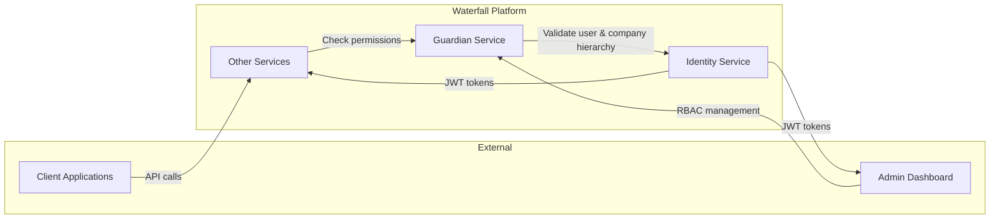
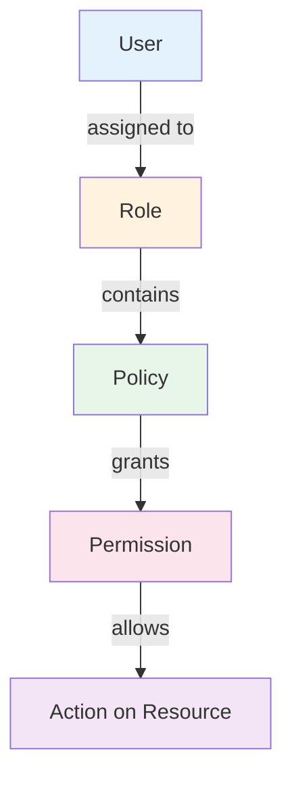
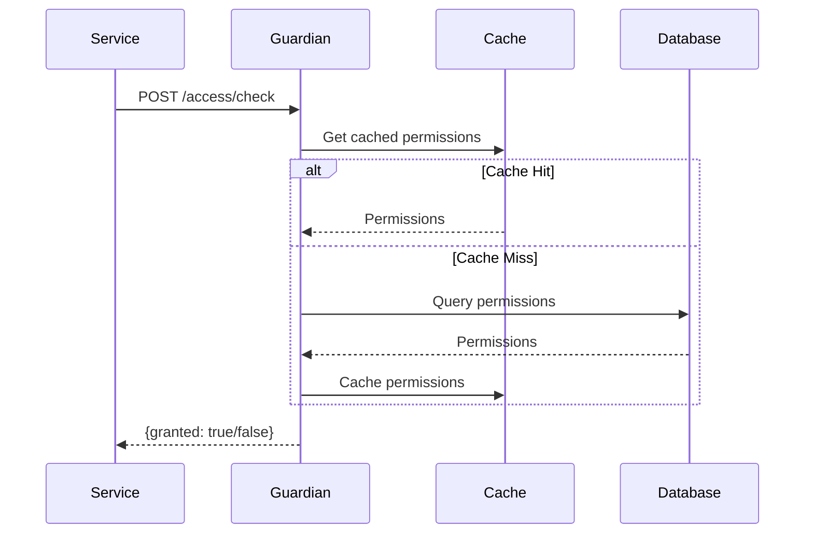

  

# Waterfall Guardian Documentation

Technical documentation for the Waterfall Guardian Authorization Service.

## 🎯 Overview

The **Guardian Service** is the centralized authorization engine for the Waterfall Platform:

- **Role-Based Access Control (RBAC)** - Hierarchical roles, policies, and permissions management
- **Multi-tenant Isolation** - Company-scoped authorization with strict data segregation
- **High-Performance Access Checks** - Sub-5ms latency with Redis caching
- **Comprehensive Audit Logging** - Full traceability of all authorization decisions
- **Flexible Scope Resolution** - Direct and hierarchical permission inheritance

## 📚 Main Documentation

### Guardian Service
- [**Architecture**](ARCHITECTURE.md) - Key architecture decisions and rationale
- [**Configuration**](CONFIGURATION.md) - Environment variables and configuration
- [**API Reference**](API.md) - REST endpoints, requests/responses, authentication
- [**Data Models**](MODELS.md) - Entities, relationships, database schema
- [**Workflows**](WORKFLOWS.md) - Authorization process sequence diagrams
- [**Monitoring**](MONITORING.md) - Prometheus metrics, alerts and Grafana dashboards

### Development Standards
- [**Coding Standards**](CODING_STANDARDS.md) - Code style, conventions and best practices

### OpenAPI Specification
- [**OpenAPI Specifications**](openapi/) - REST documentation and JSON schemas

### Monitoring & Observability
- [**Monitoring Guide**](monitoring/MONITORING.md) - Monitoring stack configuration
- [**Metrics Documentation**](monitoring/METRICS.md) - Prometheus metrics reference
- [**Grafana Setup**](monitoring/GRAFANA.md) - Dashboard configuration

---

## 🔗 Relationships with Other Services

| Service | Interaction |
|---------|-------------|
| **Identity** | Provides JWT tokens with `user_id` and `company_id` to all services and dashboards. Guardian validates user existence and retrieves company hierarchy for hierarchical scope resolution. |
| **Other Services** | Receive client requests, extract JWT claims, then call Guardian's `/access/check` endpoint to verify user permissions before processing. |
| **Admin Dashboard** | Directly calls Guardian's management API to configure roles, policies, and permissions. |

---

## 🏗️ Core Concepts

### RBAC Hierarchy

### Permission Check Flow

---

## 🧪 Tests

- [Unit Tests](../tests/unit/README.md)
- [Integration Tests](../tests/integration/README.md)

## 🚀 Quick Links

- [Main README](../README.md)
- [Contributing Guidelines](../CONTRIBUTING.md)
- [License](../LICENSE.md)
