

  

# Waterfall Guardian Workflows

> Sequence diagrams for the main workflows of the Guardian Authorization Service.

## Table of Contents

- [Waterfall Guardian Workflows](#waterfall-guardian-workflows)
  - [Table of Contents](#table-of-contents)
  - [System Bootstrap](#system-bootstrap)
  - [Company Roles Initialization](#company-roles-initialization)
  - [Permission Seeding](#permission-seeding)
  - [Role Creation](#role-creation)
  - [Policy Creation](#policy-creation)
  - [Attach Policy to Role](#attach-policy-to-role)
  - [Attach Permission to Policy](#attach-permission-to-policy)
  - [Assign Role to User](#assign-role-to-user)
  - [Access Check (Single)](#access-check-single)
  - [Batch Access Check](#batch-access-check)
  - [Get User Permissions](#get-user-permissions)
  - [Cache Strategy](#cache-strategy)
  - [Cache Invalidation](#cache-invalidation)
  - [Audit Logging](#audit-logging)
  - [Audit Log Purge (GDPR)](#audit-log-purge-gdpr)
  - [Full Flow: Service Access Control](#full-flow-service-access-control)
  - [Scope Resolution](#scope-resolution)
  - [UserRole State Diagram](#userrole-state-diagram)
  - [Permission Resolution Chain](#permission-resolution-chain)

---

## System Bootstrap

Workflow for initializing RBAC when the first company is created (called by Identity service).

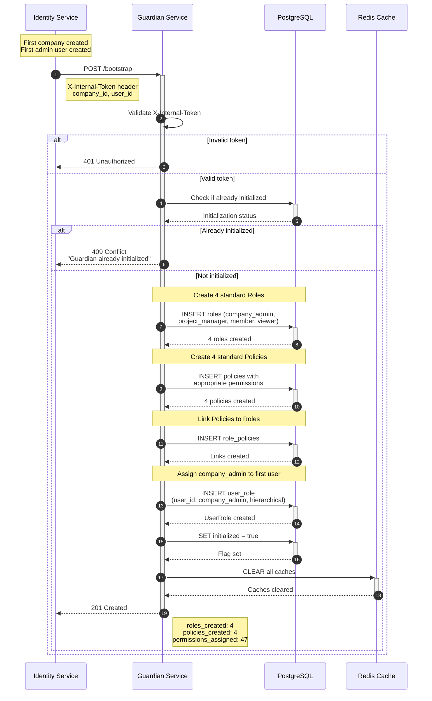
```mermaid
sequenceDiagram
    autonumber
    participant Identity as Identity Service
    participant Guardian as Guardian Service
    participant DB as PostgreSQL
    participant Redis as Redis Cache

    Note over Identity: First company created<br/>First admin user created

    Identity->>+Guardian: POST /bootstrap
    Note right of Identity: X-Internal-Token header<br/>company_id, user_id

    Guardian->>Guardian: Validate X-Internal-Token

    alt Invalid token
        Guardian-->>Identity: 401 Unauthorized
    else Valid token
        Guardian->>+DB: Check if already initialized
        DB-->>-Guardian: Initialization status

        alt Already initialized
            Guardian-->>Identity: 409 Conflict<br/>"Guardian already initialized"
        else Not initialized
            Note over Guardian,DB: Create 4 standard Roles
            Guardian->>+DB: INSERT roles (company_admin,<br/>project_manager, member, viewer)
            DB-->>-Guardian: 4 roles created

            Note over Guardian,DB: Create 4 standard Policies
            Guardian->>+DB: INSERT policies with<br/>appropriate permissions
            DB-->>-Guardian: 4 policies created

            Note over Guardian,DB: Link Policies to Roles
            Guardian->>+DB: INSERT role_policies
            DB-->>-Guardian: Links created

            Note over Guardian,DB: Assign company_admin to first user
            Guardian->>+DB: INSERT user_role<br/>(user_id, company_admin, hierarchical)
            DB-->>-Guardian: UserRole created

            Guardian->>+DB: SET initialized = true
            DB-->>-Guardian: Flag set

            Guardian->>+Redis: CLEAR all caches
            Redis-->>-Guardian: Caches cleared

            Guardian-->>-Identity: 201 Created
            Note right of Guardian: roles_created: 4<br/>policies_created: 4<br/>permissions_assigned: 47
        end
    end
```

---

## Company Roles Initialization

Workflow for initializing roles when a new company is created (after bootstrap).

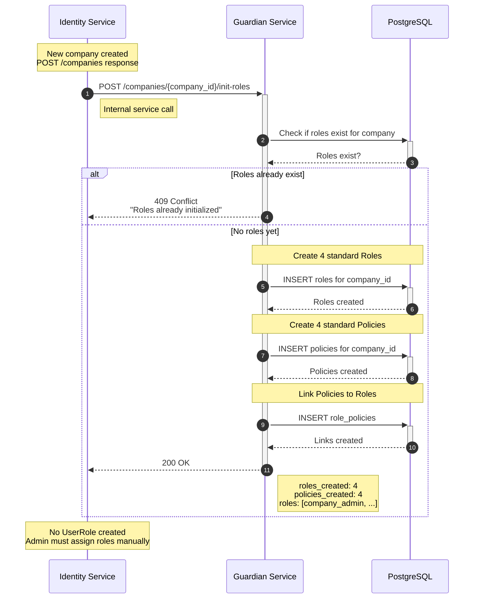
```mermaid
sequenceDiagram
    autonumber
    participant Identity as Identity Service
    participant Guardian as Guardian Service
    participant DB as PostgreSQL

    Note over Identity: New company created<br/>POST /companies response

    Identity->>+Guardian: POST /companies/{company_id}/init-roles
    Note right of Identity: Internal service call

    Guardian->>+DB: Check if roles exist for company
    DB-->>-Guardian: Roles exist?

    alt Roles already exist
        Guardian-->>Identity: 409 Conflict<br/>"Roles already initialized"
    else No roles yet
        Note over Guardian,DB: Create 4 standard Roles
        Guardian->>+DB: INSERT roles for company_id
        DB-->>-Guardian: Roles created

        Note over Guardian,DB: Create 4 standard Policies
        Guardian->>+DB: INSERT policies for company_id
        DB-->>-Guardian: Policies created

        Note over Guardian,DB: Link Policies to Roles
        Guardian->>+DB: INSERT role_policies
        DB-->>-Guardian: Links created

        Guardian-->>-Identity: 200 OK
        Note right of Guardian: roles_created: 4<br/>policies_created: 4<br/>roles: [company_admin, ...]
    end

    Note over Identity: No UserRole created<br/>Admin must assign roles manually
```

**Difference from Bootstrap:**
- `/bootstrap`: First company + assigns `company_admin` to first user
- `/companies/{id}/init-roles`: Subsequent companies + no automatic assignment

---

## Permission Seeding

Workflow for seeding system permissions at application startup.

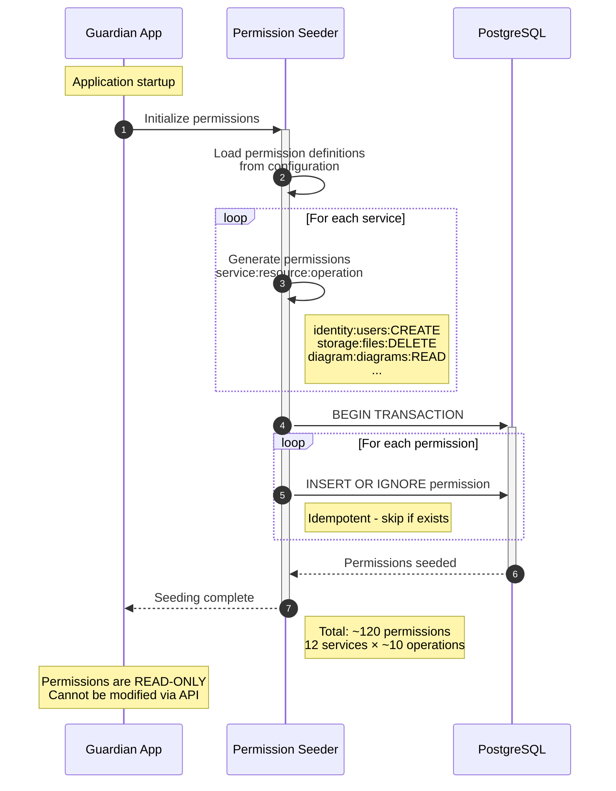
```mermaid
sequenceDiagram
    autonumber
    participant App as Guardian App
    participant Seed as Permission Seeder
    participant DB as PostgreSQL

    Note over App: Application startup

    App->>+Seed: Initialize permissions

    Seed->>Seed: Load permission definitions<br/>from configuration

    loop For each service
        Seed->>Seed: Generate permissions<br/>service:resource:operation

        Note right of Seed: identity:users:CREATE<br/>storage:files:DELETE<br/>diagram:diagrams:READ<br/>...
    end

    Seed->>+DB: BEGIN TRANSACTION

    loop For each permission
        Seed->>DB: INSERT OR IGNORE permission
        Note right of Seed: Idempotent - skip if exists
    end

    DB-->>-Seed: Permissions seeded

    Seed-->>-App: Seeding complete
    Note right of Seed: Total: ~120 permissions<br/>12 services × ~10 operations

    Note over App: Permissions are READ-ONLY<br/>Cannot be modified via API
```

**Permission Format:** `{service}:{resource}:{operation}`

**Available Services:**
- `identity`, `storage`, `project`, `diagram`, `requirement`
- `system`, `work`, `budget`, `timesheet`, `analytics`
- `basic-io`, `resources`

**Available Operations:**
- `LIST`, `CREATE`, `READ`, `UPDATE`, `DELETE`
- `APPROVE`, `EXPORT`, `IMPORT`

---

## Role Creation

Workflow for creating a new custom role.

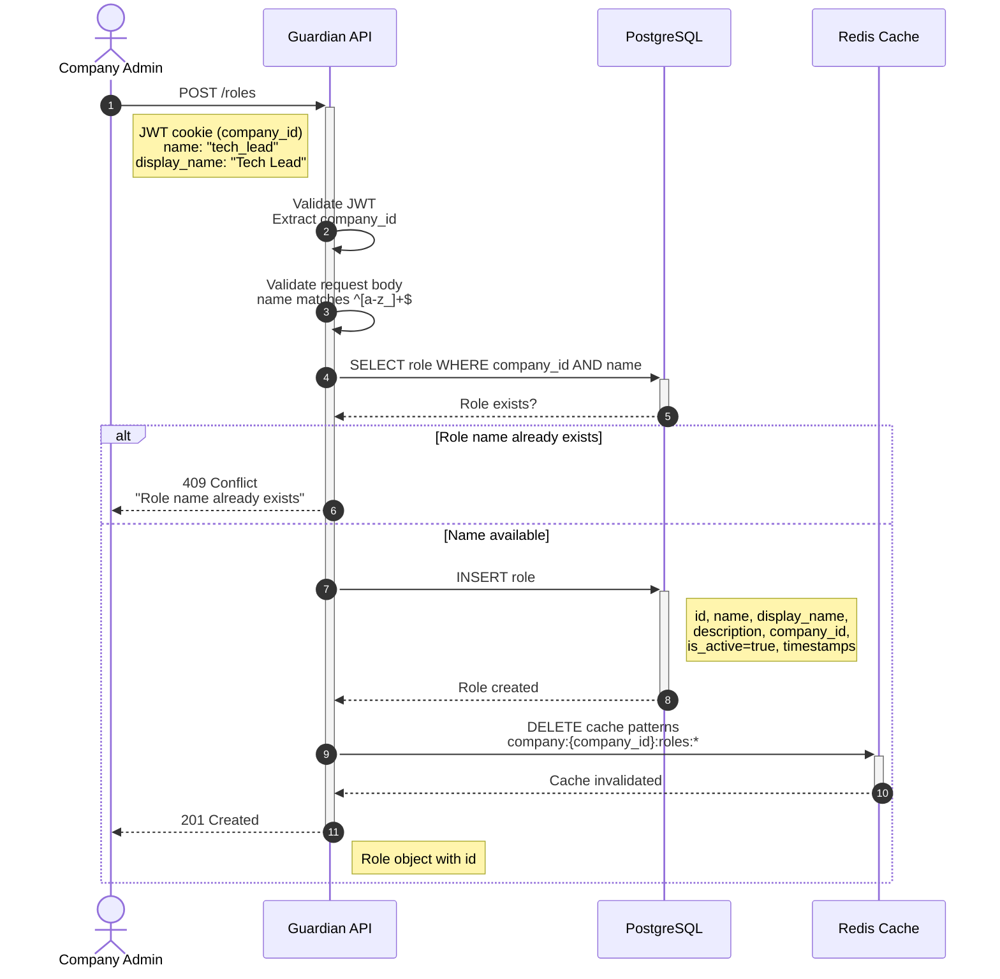
```mermaid
sequenceDiagram
    autonumber
    actor Admin as Company Admin
    participant API as Guardian API
    participant DB as PostgreSQL
    participant Redis as Redis Cache

    Admin->>+API: POST /roles
    Note right of Admin: JWT cookie (company_id)<br/>name: "tech_lead"<br/>display_name: "Tech Lead"

    API->>API: Validate JWT<br/>Extract company_id

    API->>API: Validate request body<br/>name matches ^[a-z_]+$

    API->>+DB: SELECT role WHERE company_id AND name
    DB-->>-API: Role exists?

    alt Role name already exists
        API-->>Admin: 409 Conflict<br/>"Role name already exists"
    else Name available
        API->>+DB: INSERT role
        Note right of DB: id, name, display_name,<br/>description, company_id,<br/>is_active=true, timestamps
        DB-->>-API: Role created

        API->>+Redis: DELETE cache patterns<br/>company:{company_id}:roles:*
        Redis-->>-API: Cache invalidated

        API-->>-Admin: 201 Created
        Note right of API: Role object with id
    end
```

---

## Policy Creation

Workflow for creating a new policy with permissions.

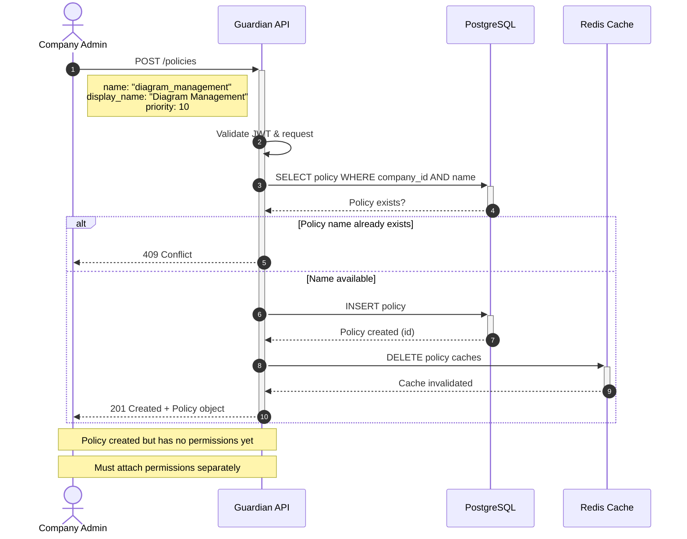
```mermaid
sequenceDiagram
    autonumber
    actor Admin as Company Admin
    participant API as Guardian API
    participant DB as PostgreSQL
    participant Redis as Redis Cache

    Admin->>+API: POST /policies
    Note right of Admin: name: "diagram_management"<br/>display_name: "Diagram Management"<br/>priority: 10

    API->>API: Validate JWT & request

    API->>+DB: SELECT policy WHERE company_id AND name
    DB-->>-API: Policy exists?

    alt Policy name already exists
        API-->>Admin: 409 Conflict
    else Name available
        API->>+DB: INSERT policy
        DB-->>-API: Policy created (id)

        API->>+Redis: DELETE policy caches
        Redis-->>-API: Cache invalidated

        API-->>-Admin: 201 Created + Policy object
    end

    Note over Admin,API: Policy created but has no permissions yet
    Note over Admin,API: Must attach permissions separately
```

---

## Attach Policy to Role

Workflow for linking a policy to a role.

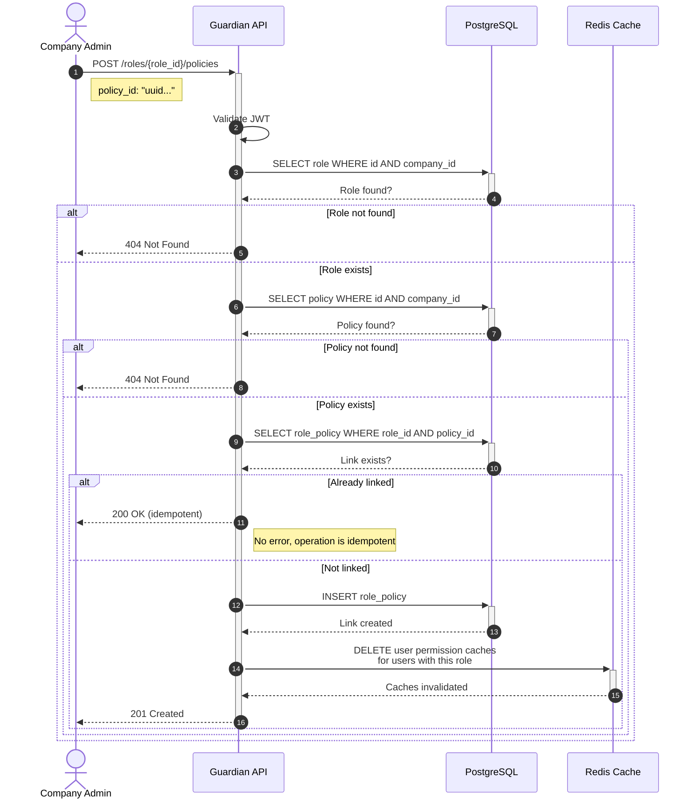
```mermaid
sequenceDiagram
    autonumber
    actor Admin as Company Admin
    participant API as Guardian API
    participant DB as PostgreSQL
    participant Redis as Redis Cache

    Admin->>+API: POST /roles/{role_id}/policies
    Note right of Admin: policy_id: "uuid..."

    API->>API: Validate JWT

    API->>+DB: SELECT role WHERE id AND company_id
    DB-->>-API: Role found?

    alt Role not found
        API-->>Admin: 404 Not Found
    else Role exists
        API->>+DB: SELECT policy WHERE id AND company_id
        DB-->>-API: Policy found?

        alt Policy not found
            API-->>Admin: 404 Not Found
        else Policy exists
            API->>+DB: SELECT role_policy WHERE role_id AND policy_id
            DB-->>-API: Link exists?

            alt Already linked
                API-->>Admin: 200 OK (idempotent)
                Note right of API: No error, operation is idempotent
            else Not linked
                API->>+DB: INSERT role_policy
                DB-->>-API: Link created

                API->>+Redis: DELETE user permission caches<br/>for users with this role
                Redis-->>-API: Caches invalidated

                API-->>-Admin: 201 Created
            end
        end
    end
```

---

## Attach Permission to Policy

Workflow for adding a permission to a policy.

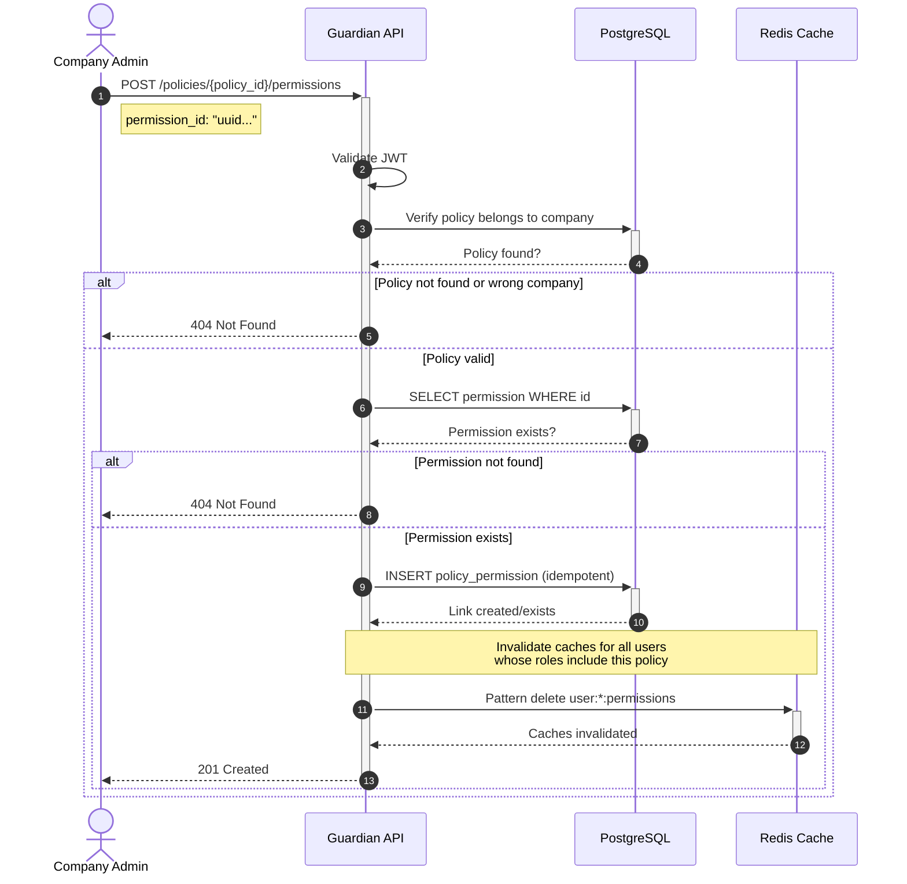
```mermaid
sequenceDiagram
    autonumber
    actor Admin as Company Admin
    participant API as Guardian API
    participant DB as PostgreSQL
    participant Redis as Redis Cache

    Admin->>+API: POST /policies/{policy_id}/permissions
    Note right of Admin: permission_id: "uuid..."

    API->>API: Validate JWT

    API->>+DB: Verify policy belongs to company
    DB-->>-API: Policy found?

    alt Policy not found or wrong company
        API-->>Admin: 404 Not Found
    else Policy valid
        API->>+DB: SELECT permission WHERE id
        DB-->>-API: Permission exists?

        alt Permission not found
            API-->>Admin: 404 Not Found
        else Permission exists
            API->>+DB: INSERT policy_permission (idempotent)
            DB-->>-API: Link created/exists

            Note over API,Redis: Invalidate caches for all users<br/>whose roles include this policy
            API->>+Redis: Pattern delete user:*:permissions
            Redis-->>-API: Caches invalidated

            API-->>-Admin: 201 Created
        end
    end
```

---

## Assign Role to User

Workflow for assigning a role to a user with scope configuration.

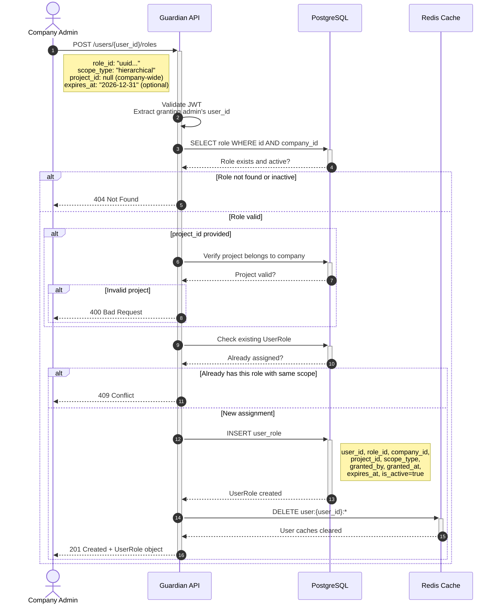
```mermaid
sequenceDiagram
    autonumber
    actor Admin as Company Admin
    participant API as Guardian API
    participant DB as PostgreSQL
    participant Redis as Redis Cache

    Admin->>+API: POST /users/{user_id}/roles
    Note right of Admin: role_id: "uuid..."<br/>scope_type: "hierarchical"<br/>project_id: null (company-wide)<br/>expires_at: "2026-12-31" (optional)

    API->>API: Validate JWT<br/>Extract granting admin's user_id

    API->>+DB: SELECT role WHERE id AND company_id
    DB-->>-API: Role exists and active?

    alt Role not found or inactive
        API-->>Admin: 404 Not Found
    else Role valid
        alt project_id provided
            API->>+DB: Verify project belongs to company
            DB-->>-API: Project valid?
            alt Invalid project
                API-->>Admin: 400 Bad Request
            end
        end

        API->>+DB: Check existing UserRole
        DB-->>-API: Already assigned?

        alt Already has this role with same scope
            API-->>Admin: 409 Conflict
        else New assignment
            API->>+DB: INSERT user_role
            Note right of DB: user_id, role_id, company_id,<br/>project_id, scope_type,<br/>granted_by, granted_at,<br/>expires_at, is_active=true
            DB-->>-API: UserRole created

            API->>+Redis: DELETE user:{user_id}:*
            Redis-->>-API: User caches cleared

            API-->>-Admin: 201 Created + UserRole object
        end
    end
```

**Scope Combinations:**

| project_id | scope_type | Effect |
|------------|------------|--------|
| NULL | direct | Company-wide, exact company only |
| NULL | hierarchical | Company + all child companies |
| UUID | direct | Specific project only |

---

## Access Check (Single)

**Most critical workflow** - Called thousands of times per day.

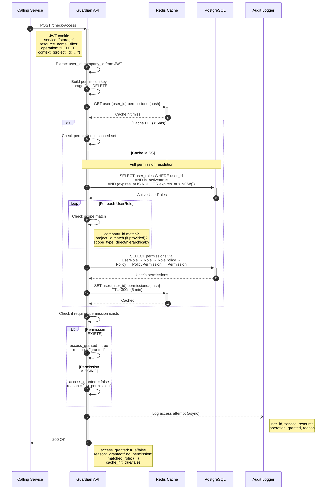
```mermaid
sequenceDiagram
    autonumber
    participant Service as Calling Service
    participant API as Guardian API
    participant Redis as Redis Cache
    participant DB as PostgreSQL
    participant Audit as Audit Logger

    Service->>+API: POST /check-access
    Note right of Service: JWT cookie<br/>service: "storage"<br/>resource_name: "files"<br/>operation: "DELETE"<br/>context: {project_id: "..."}

    API->>API: Extract user_id, company_id from JWT

    API->>API: Build permission key<br/>storage:files:DELETE

    API->>+Redis: GET user:{user_id}:permissions:{hash}
    Redis-->>-API: Cache hit/miss

    alt Cache HIT (< 5ms)
        API->>API: Check permission in cached set
    else Cache MISS
        Note over API,DB: Full permission resolution

        API->>+DB: SELECT user_roles WHERE user_id<br/>AND is_active=true<br/>AND (expires_at IS NULL OR expires_at > NOW())
        DB-->>-API: Active UserRoles

        loop For each UserRole
            API->>API: Check scope match
            Note right of API: company_id match?<br/>project_id match (if provided)?<br/>scope_type (direct/hierarchical)?
        end

        API->>+DB: SELECT permissions via<br/>UserRole → Role → RolePolicy →<br/>Policy → PolicyPermission → Permission
        DB-->>-API: User's permissions

        API->>+Redis: SET user:{user_id}:permissions:{hash}<br/>TTL=300s (5 min)
        Redis-->>-API: Cached
    end

    API->>API: Check if required permission exists

    alt Permission EXISTS
        API->>API: access_granted = true<br/>reason = "granted"
    else Permission MISSING
        API->>API: access_granted = false<br/>reason = "no_permission"
    end

    API--)Audit: Log access attempt (async)
    Note right of Audit: user_id, service, resource,<br/>operation, granted, reason

    API-->>-Service: 200 OK
    Note right of API: access_granted: true/false<br/>reason: "granted"/"no_permission"<br/>matched_role: {...}<br/>cache_hit: true/false
```

**Performance Targets:**
- Cache hit: < 5ms
- Cache miss: < 30ms

---

## Batch Access Check

Workflow for checking multiple permissions at once (UI optimization).

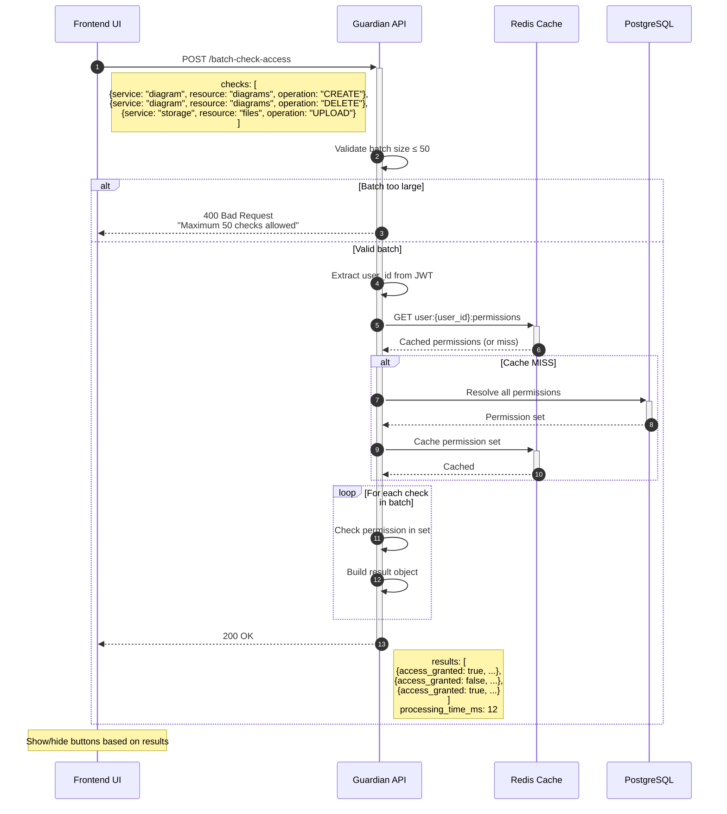
```mermaid
sequenceDiagram
    autonumber
    participant UI as Frontend UI
    participant API as Guardian API
    participant Redis as Redis Cache
    participant DB as PostgreSQL

    UI->>+API: POST /batch-check-access
    Note right of UI: checks: [<br/>  {service: "diagram", resource: "diagrams", operation: "CREATE"},<br/>  {service: "diagram", resource: "diagrams", operation: "DELETE"},<br/>  {service: "storage", resource: "files", operation: "UPLOAD"}<br/>]

    API->>API: Validate batch size ≤ 50

    alt Batch too large
        API-->>UI: 400 Bad Request<br/>"Maximum 50 checks allowed"
    else Valid batch
        API->>API: Extract user_id from JWT

        API->>+Redis: GET user:{user_id}:permissions
        Redis-->>-API: Cached permissions (or miss)

        alt Cache MISS
            API->>+DB: Resolve all permissions
            DB-->>-API: Permission set
            API->>+Redis: Cache permission set
            Redis-->>-API: Cached
        end

        loop For each check in batch
            API->>API: Check permission in set
            API->>API: Build result object
        end

        API-->>-UI: 200 OK
        Note right of API: results: [<br/>  {access_granted: true, ...},<br/>  {access_granted: false, ...},<br/>  {access_granted: true, ...}<br/>]<br/>processing_time_ms: 12
    end

    Note over UI: Show/hide buttons based on results
```

**Use Case:** Determine which action buttons to display in UI.

---

## Get User Permissions

Workflow for retrieving all permissions for a user (debugging, profile display).

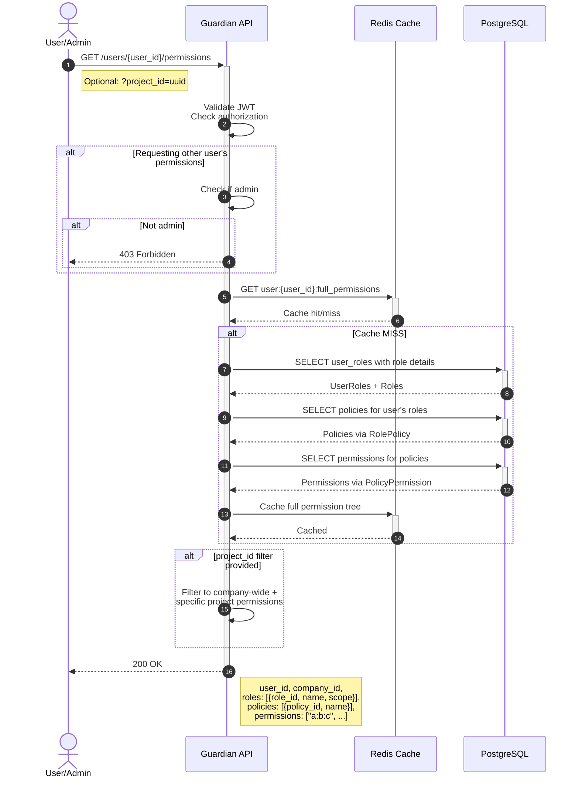
```mermaid
sequenceDiagram
    autonumber
    actor User as User/Admin
    participant API as Guardian API
    participant Redis as Redis Cache
    participant DB as PostgreSQL

    User->>+API: GET /users/{user_id}/permissions
    Note right of User: Optional: ?project_id=uuid

    API->>API: Validate JWT<br/>Check authorization

    alt Requesting other user's permissions
        API->>API: Check if admin
        alt Not admin
            API-->>User: 403 Forbidden
        end
    end

    API->>+Redis: GET user:{user_id}:full_permissions
    Redis-->>-API: Cache hit/miss

    alt Cache MISS
        API->>+DB: SELECT user_roles with role details
        DB-->>-API: UserRoles + Roles

        API->>+DB: SELECT policies for user's roles
        DB-->>-API: Policies via RolePolicy

        API->>+DB: SELECT permissions for policies
        DB-->>-API: Permissions via PolicyPermission

        API->>+Redis: Cache full permission tree
        Redis-->>-API: Cached
    end

    alt project_id filter provided
        API->>API: Filter to company-wide +<br/>specific project permissions
    end

    API-->>-User: 200 OK
    Note right of API: user_id, company_id,<br/>roles: [{role_id, name, scope}],<br/>policies: [{policy_id, name}],<br/>permissions: ["a:b:c", ...]
```

---

## Cache Strategy

Overview of Redis caching strategy for high-performance access checks.

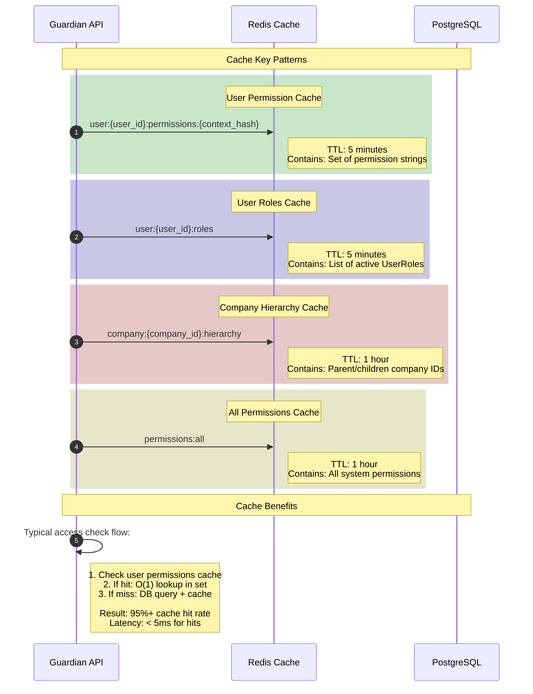
```mermaid
sequenceDiagram
    autonumber
    participant API as Guardian API
    participant Redis as Redis Cache
    participant DB as PostgreSQL

    Note over API,DB: Cache Key Patterns

    rect rgb(200, 230, 200)
        Note over Redis: User Permission Cache
        API->>Redis: user:{user_id}:permissions:{context_hash}
        Note right of Redis: TTL: 5 minutes<br/>Contains: Set of permission strings
    end

    rect rgb(200, 200, 230)
        Note over Redis: User Roles Cache
        API->>Redis: user:{user_id}:roles
        Note right of Redis: TTL: 5 minutes<br/>Contains: List of active UserRoles
    end

    rect rgb(230, 200, 200)
        Note over Redis: Company Hierarchy Cache
        API->>Redis: company:{company_id}:hierarchy
        Note right of Redis: TTL: 1 hour<br/>Contains: Parent/children company IDs
    end

    rect rgb(230, 230, 200)
        Note over Redis: All Permissions Cache
        API->>Redis: permissions:all
        Note right of Redis: TTL: 1 hour<br/>Contains: All system permissions
    end

    Note over API,DB: Cache Benefits

    API->>API: Typical access check flow:
    Note right of API: 1. Check user permissions cache<br/>2. If hit: O(1) lookup in set<br/>3. If miss: DB query + cache<br/><br/>Result: 95%+ cache hit rate<br/>Latency: < 5ms for hits
```

---

## Cache Invalidation

Workflow showing when and how caches are invalidated.

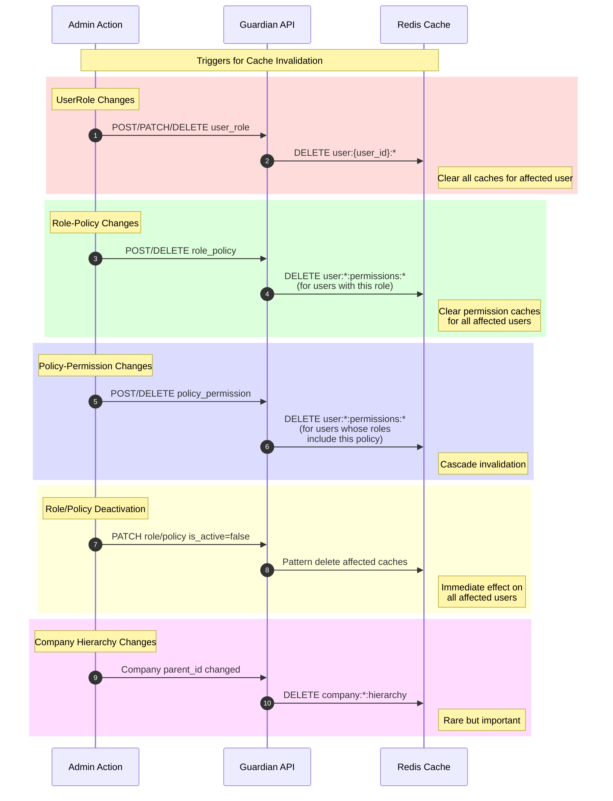
```mermaid
sequenceDiagram
    autonumber
    participant Admin as Admin Action
    participant API as Guardian API
    participant Redis as Redis Cache

    Note over Admin,Redis: Triggers for Cache Invalidation

    rect rgb(255, 220, 220)
        Note over Admin: UserRole Changes
        Admin->>API: POST/PATCH/DELETE user_role
        API->>Redis: DELETE user:{user_id}:*
        Note right of Redis: Clear all caches for affected user
    end

    rect rgb(220, 255, 220)
        Note over Admin: Role-Policy Changes
        Admin->>API: POST/DELETE role_policy
        API->>Redis: DELETE user:*:permissions:*<br/>(for users with this role)
        Note right of Redis: Clear permission caches<br/>for all affected users
    end

    rect rgb(220, 220, 255)
        Note over Admin: Policy-Permission Changes
        Admin->>API: POST/DELETE policy_permission
        API->>Redis: DELETE user:*:permissions:*<br/>(for users whose roles<br/>include this policy)
        Note right of Redis: Cascade invalidation
    end

    rect rgb(255, 255, 220)
        Note over Admin: Role/Policy Deactivation
        Admin->>API: PATCH role/policy is_active=false
        API->>Redis: Pattern delete affected caches
        Note right of Redis: Immediate effect on<br/>all affected users
    end

    rect rgb(255, 220, 255)
        Note over Admin: Company Hierarchy Changes
        Admin->>API: Company parent_id changed
        API->>Redis: DELETE company:*:hierarchy
        Note right of Redis: Rare but important
    end
```

---

## Audit Logging

Workflow for recording access attempts in audit log.

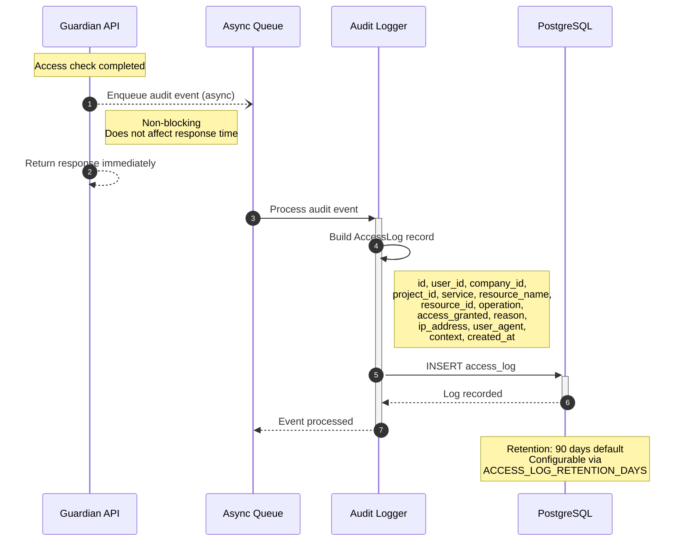
```mermaid
sequenceDiagram
    autonumber
    participant API as Guardian API
    participant Queue as Async Queue
    participant Logger as Audit Logger
    participant DB as PostgreSQL

    Note over API: Access check completed

    API--)Queue: Enqueue audit event (async)
    Note right of API: Non-blocking<br/>Does not affect response time

    API-->>API: Return response immediately

    Queue->>+Logger: Process audit event

    Logger->>Logger: Build AccessLog record
    Note right of Logger: id, user_id, company_id,<br/>project_id, service, resource_name,<br/>resource_id, operation,<br/>access_granted, reason,<br/>ip_address, user_agent,<br/>context, created_at

    Logger->>+DB: INSERT access_log
    DB-->>-Logger: Log recorded

    Logger-->>-Queue: Event processed

    Note over DB: Retention: 90 days default<br/>Configurable via<br/>ACCESS_LOG_RETENTION_DAYS
```

---

## Audit Log Purge (GDPR)

Workflow for purging old audit logs (GDPR compliance).

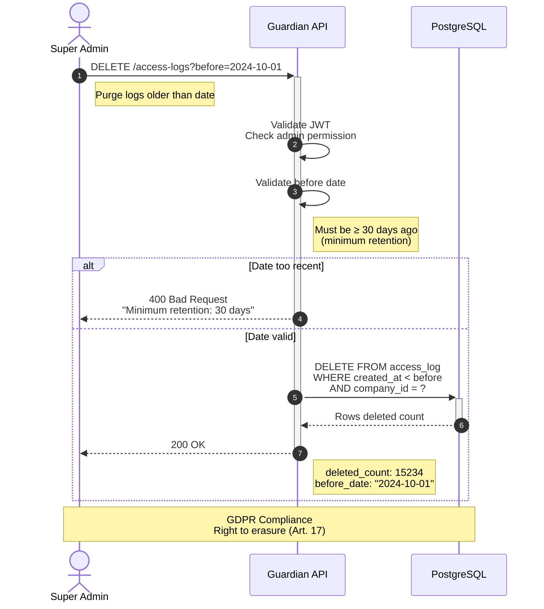
```mermaid
sequenceDiagram
    autonumber
    actor Admin as Super Admin
    participant API as Guardian API
    participant DB as PostgreSQL

    Admin->>+API: DELETE /access-logs?before=2024-10-01
    Note right of Admin: Purge logs older than date

    API->>API: Validate JWT<br/>Check admin permission

    API->>API: Validate before date
    Note right of API: Must be ≥ 30 days ago<br/>(minimum retention)

    alt Date too recent
        API-->>Admin: 400 Bad Request<br/>"Minimum retention: 30 days"
    else Date valid
        API->>+DB: DELETE FROM access_log<br/>WHERE created_at < before<br/>AND company_id = ?
        DB-->>-API: Rows deleted count

        API-->>-Admin: 200 OK
        Note right of API: deleted_count: 15234<br/>before_date: "2024-10-01"
    end

    Note over Admin,DB: GDPR Compliance<br/>Right to erasure (Art. 17)
```

---

## Full Flow: Service Access Control

Complete workflow showing a microservice request with Guardian authorization.

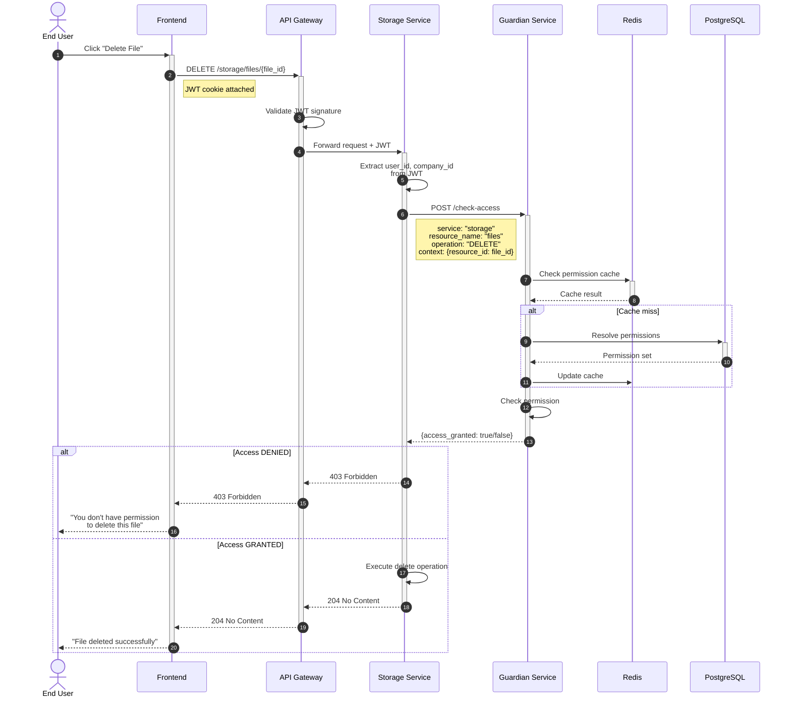
```mermaid
sequenceDiagram
    autonumber
    actor User as End User
    participant UI as Frontend
    participant Gateway as API Gateway
    participant Service as Storage Service
    participant Guardian as Guardian Service
    participant Redis as Redis
    participant DB as PostgreSQL

    User->>+UI: Click "Delete File"
    UI->>+Gateway: DELETE /storage/files/{file_id}
    Note right of UI: JWT cookie attached

    Gateway->>Gateway: Validate JWT signature
    Gateway->>+Service: Forward request + JWT

    Service->>Service: Extract user_id, company_id<br/>from JWT

    Service->>+Guardian: POST /check-access
    Note right of Service: service: "storage"<br/>resource_name: "files"<br/>operation: "DELETE"<br/>context: {resource_id: file_id}

    Guardian->>+Redis: Check permission cache
    Redis-->>-Guardian: Cache result

    alt Cache miss
        Guardian->>+DB: Resolve permissions
        DB-->>-Guardian: Permission set
        Guardian->>Redis: Update cache
    end

    Guardian->>Guardian: Check permission

    Guardian-->>-Service: {access_granted: true/false}

    alt Access DENIED
        Service-->>Gateway: 403 Forbidden
        Gateway-->>UI: 403 Forbidden
        UI-->>User: "You don't have permission<br/>to delete this file"
    else Access GRANTED
        Service->>Service: Execute delete operation
        Service-->>-Gateway: 204 No Content
        Gateway-->>-UI: 204 No Content
        UI-->>-User: "File deleted successfully"
    end
```

---

## Scope Resolution

Detailed workflow showing how scopes are evaluated during access checks.

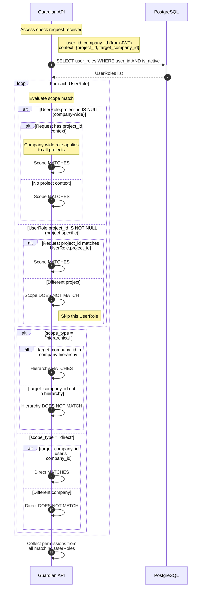
```mermaid
sequenceDiagram
    autonumber
    participant API as Guardian API
    participant DB as PostgreSQL

    Note over API: Access check request received
    Note right of API: user_id, company_id (from JWT)<br/>context: {project_id, target_company_id}

    API->>+DB: SELECT user_roles WHERE user_id AND is_active
    DB-->>-API: UserRoles list

    loop For each UserRole
        Note over API: Evaluate scope match

        alt UserRole.project_id IS NULL (company-wide)
            alt Request has project_id context
                Note over API: Company-wide role applies<br/>to all projects
                API->>API: Scope MATCHES
            else No project context
                API->>API: Scope MATCHES
            end
        else UserRole.project_id IS NOT NULL (project-specific)
            alt Request project_id matches UserRole.project_id
                API->>API: Scope MATCHES
            else Different project
                API->>API: Scope DOES NOT MATCH
                Note right of API: Skip this UserRole
            end
        end

        alt scope_type = "hierarchical"
            alt target_company_id in company hierarchy
                API->>API: Hierarchy MATCHES
            else target_company_id not in hierarchy
                API->>API: Hierarchy DOES NOT MATCH
            end
        else scope_type = "direct"
            alt target_company_id = user's company_id
                API->>API: Direct MATCHES
            else Different company
                API->>API: Direct DOES NOT MATCH
            end
        end
    end

    API->>API: Collect permissions from<br/>all matching UserRoles
```

**Scope Examples:**

| Scenario | UserRole Config | Request Context | Result |
|----------|-----------------|-----------------|--------|
| Company admin | project_id=NULL, scope=hierarchical | Any project in company tree | ✅ Match |
| Project member | project_id=ABC, scope=direct | project_id=ABC | ✅ Match |
| Project member | project_id=ABC, scope=direct | project_id=XYZ | ❌ No match |
| Subsidiary access | scope=hierarchical | target_company=child | ✅ Match |
| Subsidiary access | scope=direct | target_company=child | ❌ No match |

---

## UserRole State Diagram

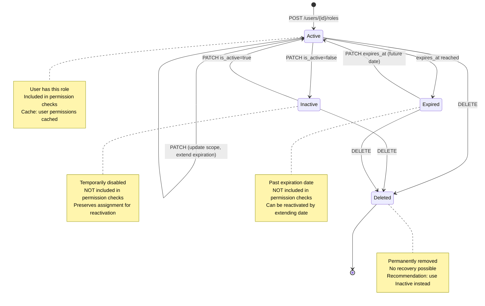
```mermaid
stateDiagram-v2
    [*] --> Active: POST /users/{id}/roles

    Active --> Active: PATCH (update scope, extend expiration)
    Active --> Inactive: PATCH is_active=false
    Active --> Expired: expires_at reached
    Active --> Deleted: DELETE

    Inactive --> Active: PATCH is_active=true
    Inactive --> Deleted: DELETE

    Expired --> Active: PATCH expires_at (future date)
    Expired --> Deleted: DELETE

    Deleted --> [*]

    note right of Active
        User has this role
        Included in permission checks
        Cache: user permissions cached
    end note

    note right of Inactive
        Temporarily disabled
        NOT included in permission checks
        Preserves assignment for reactivation
    end note

    note right of Expired
        Past expiration date
        NOT included in permission checks
        Can be reactivated by extending date
    end note

    note right of Deleted
        Permanently removed
        No recovery possible
        Recommendation: use Inactive instead
    end note
```

---

## Permission Resolution Chain

How permissions are resolved from User to Permission.

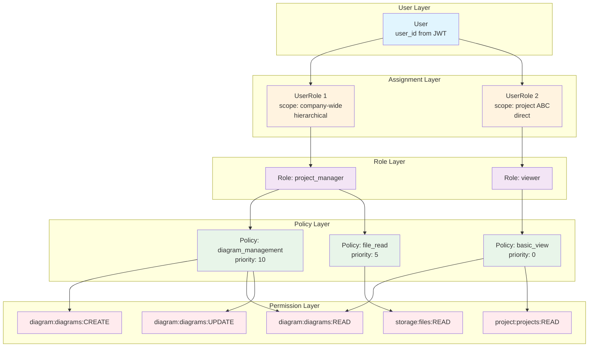
```mermaid
flowchart TD
    subgraph User Layer
        U[User<br/>user_id from JWT]
    end

    subgraph Assignment Layer
        UR1[UserRole 1<br/>scope: company-wide<br/>hierarchical]
        UR2[UserRole 2<br/>scope: project ABC<br/>direct]
    end

    subgraph Role Layer
        R1[Role: project_manager]
        R2[Role: viewer]
    end

    subgraph Policy Layer
        P1[Policy: diagram_management<br/>priority: 10]
        P2[Policy: file_read<br/>priority: 5]
        P3[Policy: basic_view<br/>priority: 0]
    end

    subgraph Permission Layer
        PERM1[diagram:diagrams:CREATE]
        PERM2[diagram:diagrams:READ]
        PERM3[diagram:diagrams:UPDATE]
        PERM4[storage:files:READ]
        PERM5[project:projects:READ]
    end

    U --> UR1
    U --> UR2

    UR1 --> R1
    UR2 --> R2

    R1 --> P1
    R1 --> P2
    R2 --> P3

    P1 --> PERM1
    P1 --> PERM2
    P1 --> PERM3
    P2 --> PERM4
    P3 --> PERM2
    P3 --> PERM5

    style U fill:#e1f5fe
    style UR1 fill:#fff3e0
    style UR2 fill:#fff3e0
    style R1 fill:#f3e5f5
    style R2 fill:#f3e5f5
    style P1 fill:#e8f5e9
    style P2 fill:#e8f5e9
    style P3 fill:#e8f5e9
    style PERM1 fill:#ffebee
    style PERM2 fill:#ffebee
    style PERM3 fill:#ffebee
    style PERM4 fill:#ffebee
    style PERM5 fill:#ffebee
```

**Resolution Algorithm:**
1. Find all active, non-expired UserRoles for user
2. Filter by scope (company/project match)
3. Get Roles from matching UserRoles
4. Get Policies from Roles (via RolePolicy)
5. Get Permissions from Policies (via PolicyPermission)
6. Union all permissions into final set
7. Cache result for 5 minutes

---

## Role Update with Cascade

Workflow showing the impact of role deactivation.

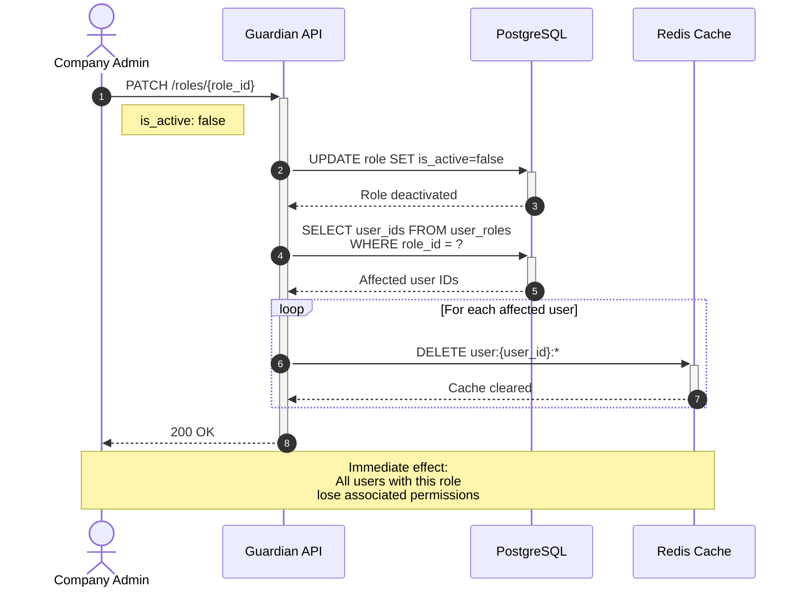
```mermaid
sequenceDiagram
    autonumber
    actor Admin as Company Admin
    participant API as Guardian API
    participant DB as PostgreSQL
    participant Redis as Redis Cache

    Admin->>+API: PATCH /roles/{role_id}
    Note right of Admin: is_active: false

    API->>+DB: UPDATE role SET is_active=false
    DB-->>-API: Role deactivated

    API->>+DB: SELECT user_ids FROM user_roles<br/>WHERE role_id = ?
    DB-->>-API: Affected user IDs

    loop For each affected user
        API->>+Redis: DELETE user:{user_id}:*
        Redis-->>-API: Cache cleared
    end

    API-->>-Admin: 200 OK

    Note over Admin,Redis: Immediate effect:<br/>All users with this role<br/>lose associated permissions
```

---

## Temporary Role Assignment

Workflow for time-limited role assignments (contractors, temporary access).

```mermaid
sequenceDiagram
    autonumber
    actor Admin as Company Admin
    participant API as Guardian API
    participant DB as PostgreSQL
    participant Scheduler as Background Scheduler

    Admin->>+API: POST /users/{user_id}/roles
    Note right of Admin: role_id: "contractor_role"<br/>expires_at: "2025-03-31T23:59:59Z"

    API->>+DB: INSERT user_role with expires_at
    DB-->>-API: UserRole created

    API-->>-Admin: 201 Created

    Note over API,DB: User has role until expiration

    loop Background job (hourly)
        Scheduler->>+DB: SELECT expired user_roles<br/>WHERE expires_at < NOW()<br/>AND is_active = true
        DB-->>-Scheduler: Expired UserRoles

        Note over Scheduler: No action needed!<br/>Access check already filters<br/>by expires_at
    end

    Note over Admin,Scheduler: At expiration time:
    Note right of Scheduler: Access checks automatically<br/>exclude expired UserRoles<br/>No explicit deactivation needed
```

---

## Audit Statistics Generation

Workflow for generating aggregated audit statistics.

```mermaid
sequenceDiagram
    autonumber
    actor Admin as Security Admin
    participant API as Guardian API
    participant DB as PostgreSQL

    Admin->>+API: GET /access-logs/statistics
    Note right of Admin: from_date: "2025-01-01"<br/>to_date: "2025-01-31"

    API->>API: Validate date range

    API->>+DB: Aggregate queries
    Note right of DB: COUNT total<br/>COUNT granted<br/>COUNT denied<br/>GROUP BY service<br/>GROUP BY operation<br/>TOP 10 users

    DB-->>-API: Aggregated data

    API->>API: Calculate success_rate

    API-->>-Admin: 200 OK
    Note right of API: total_requests: 15234<br/>granted_requests: 14890<br/>denied_requests: 344<br/>success_rate: 97.74%<br/>by_service: [...]<br/>by_operation: [...]<br/>top_users: [...]
```
